# Jarkom-Modul-2-2026-K-42

## Anggota Kelompok

| | Nama | NRP |
| --- | --- | --- |
| 1 | Azita Zahwa Zahida Asmoro | 5027251058 |
| 2 | I Made Gyanendra Anand Wisnawa | 5027251072 |


## Soal 1

Pada soal 1, penugasan berfokus pada pembuatan struktur dari GNS soal Modul 2 ini sendiri.
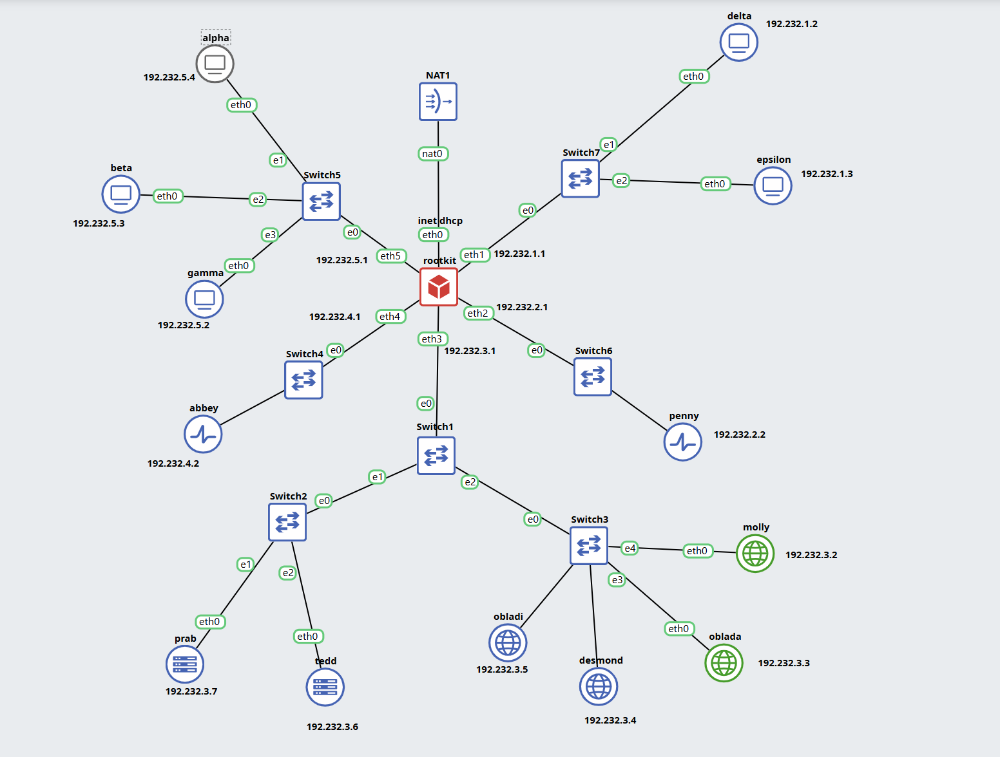

## Soal 2

###   Melakukan config pada rootkit

Untuk melakukan ping dan confignya, buka konfigurasi pada rootkit dengan perintah `nano /etc/networks/interfaces` dan ganti eth0 nya:

```bash
auto lo
iface lo inet loopback

auto eth0
iface eth0 inet static
    address 192.232.1.10
    netmask 255.255.255.0
    gateway 192.232.1.1
    dns-nameservers 8.8.8.8 1.1.1.1
    up ip route add default via 192.232.1.1 dev eth0 onlink
    post-up echo 1 > /proc/sys/net/ipv4/ip_forward
    post-up iptables -t nat -A POSTROUTING -o eth0 -j MASQUERADE
    post-up iptables -A FORWARD -i eth0 -m state --state RELATED,ESTABLISHED -j ACCEPT
    post-up iptables -A FORWARD -o eth0 -j ACCEPT
```

Selanjutnya buat file script untuk soal 1 (soal1.sh) yang berisikan:

```bash
#!/bin/bash

# Pastikan script dijalankan sebagai root
if [ "$EUID" -ne 0 ]; then
  echo "Harap jalankan script ini sebagai root!"
  exit 1
fi

echo "[*] Membersihkan konfigurasi lama eth0..."
ip addr flush dev eth0
ip route flush dev eth0

echo "[*] Mengaktifkan interface eth0..."
ip link set dev eth0 up

echo "[*] Memasang IP Utama subnet NAT GNS3 (Contoh: 192.168.122.50)..."
# Catatan: Sesuaikan 192.168.122.50 dengan subnet DHCP/bridge NAT GNS3 Anda jika berbeda
ip addr add 192.168.122.50/24 dev eth0

echo "[*] Menambahkan IP Lab kustom sebagai IP Sekunder (192.232.1.10)..."
ip addr add 192.232.1.10/24 dev eth0

echo "[*] Memasang Default Gateway ke NAT GNS3..."
ip route add default via 192.168.122.1 dev eth0

echo "[*] Mengaktifkan Kernel IP Forwarding..."
echo 1 > /proc/sys/net/ipv4/ip_forward

echo "[+] Konfigurasi selesai! Memeriksa status rute:"
ip route show
ip addr show eth0
```

Kalau sudah, jalankan dengan memberi izin eksekusi pada file.
Kemudian lakukan uji coba dengan `ping -c 3 8.8.8.8`.

#### Catatan
DIbawah ini merupakan IP Address dari tiap *node*. 

- Switch 1
  > Rootkit: 192.232.1.1

  > Delta: 192.232.1.2

  > Epsilon: 192.232.1.3

- Switch 2
  > Penny: 192.232.2.2

- Switch 3
  > Molly: 192.232.3.2
  
  > Oblada: 192.232.3.3

  > Desmond: 192.232.3.4

  > Obladi: 192.232.3.5

  > Tedd: 192.232.3.6

  > Prab: 192.232.3.7

- Switch 4
  > Abbey: 192.232.4.2

- Switch 5
  > Gamma: 192.232.5.2
  
  > Beta: 192.232.5.3

  > Alpha: 192.232.5.4

## Soal 3

Untuk menambahkan resolver 192.168.122.1 ke semua node, masukkan dengan melalui config di setiap node nya.

Contoh (delta):

```bash
auto eth0
iface eth0 inet static
        address 192.232.1.2
        netmask 255.255.255.0
        gateway 192.232.1.1
up echo 'nameserver 192.168.122.1' > /etc/resolv.conf
```

### Catatan PENTING

Untuk node `alpha`, `beta`, nameserver harus memuat IP Address yang lainnya. Agar ketika melakukan uji coba di soal-soal berikutnya bisa dijalankan dengan baik.

```bash
up echo -e 'nameserver 192.232.3.7\nnameserver 192.232.3.6\nnameserver 192.232.3.3\nnameserver 192.168.122.1' > /etc/resolv.conf
```

## Soal 4

### BIND9

Masukkan bind9 ke config di prab + tedd

```bash
up apt-get update
up apt-get install bind9 -y

# Cek dengan:
named -v
```

### Config di Prab

Untuk mengubah config dari `/etc/bind/named.conf.options` di `prab` dan `tedd`, edit isi dari file tersebut menggunakan `nano` dan sesuaikan dengan file `../soal4_prab.sh` || `../soal4_tedd.sh`.

Jika sudah, beri akses eksekusi dan jalankan. Cek BIND9 dengan menggunakan:

```bash
# Khusus untuk `prab` saja.
named-checkzone k42.com /etc/bind/jarkom/k42.com 

# Jalankan di keduanya
service named restart
service named status
```

### Bukti

- prab

- tedd


## Soal 5

"Namai semua Entitas (hostname) sesuai glosarium: rootkit, alpha, beta, gamma, delta, epsilon, prab, tedd, abbey, penny, obladi, desmond, oblada, molly, dan verifikasi bahwa setiap host mengenali hostname tersebut secara system-wide. Buat setiap domain untuk masing-masing node sesuai dengan namanya (contoh: alpha.<xxxx>.com) dan assign IP masing-masing juga. Lakukan pengecualian untuk node yang bertanggung jawab atas prab dan tedd."

Untuk menambahkan hostname setiap entitas ke dalam domainnya, kita perlu untuk set hostname ke dalam `/etc/hostname` dan supaya bisa dikenali secara system-wide, kita juga perlu menambahka nama dan ip dari nodenya ke dalam `/etc/hosts`

### Setup di node Alpha

Setup hostname

```bash
echo 'alpha' > /etc/hostname
hostname alpha
```

Setup nama dan IP supaya bisa dinekali secara system-wide (127.0.0.1)

```bash
echo '127.0.0.1 localhost
192.232.5.4 alpha.k42.com alpha' > /etc/hosts
```

Untuk melakukan pembuktian jika sudah masuk, jalankan berikut

```bash
hostname
hostname -f
cat /etc/hostname
getent hosts $(hostname)
```

Jika berhasil, akan terlihat seperti berikut


### Setup node Rootkit

```bash
echo 'rootkit' > /etc/hostname
hostname rootkit

echo '127.0.0.1 localhost
192.232.1.1 rootkit.k42.com rootkit' > /etc/hosts
```

### Setup node Beta

```bash
echo 'beta' > /etc/hostname
hostname beta

echo '127.0.0.1 localhost
192.232.5.3 beta.k42.com beta' > /etc/hosts
```

### Setup node Gamma

```bash
echo 'gamma' > /etc/hostname
hostname gamma

echo '127.0.0.1 localhost
192.232.5.2 gamma.k42.com gamma' > /etc/hosts
```

### Setup node Abbey

```bash
echo 'abbey' > /etc/hostname
hostname abbey

echo '127.0.0.1 localhost
192.232.4.2 abbey.k42.com abbey' > /etc/hosts
```

### Setup node Obladi

```bash
echo 'obladi' > /etc/hostname
hostname obladi

echo '127.0.0.1 localhost
192.232.3.5 obladi.k42.com obladi' > /etc/hosts
```

### Setup node Desmond

```bash
echo 'desmond' > /etc/hostname
hostname desmond

echo '127.0.0.1 localhost
192.232.3.4 desmond.k42.com desmond' > /etc/hosts
```

### Setup node Oblada

```bash
echo 'oblada' > /etc/hostname
hostname oblada

echo '127.0.0.1 localhost
192.232.3.3 oblada.k42.com oblada' > /etc/hosts
```

### Setup node Molly

```bash
echo 'molly' > /etc/hostname
hostname molly

echo '127.0.0.1 localhost
192.232.3.2 molly.k42.com molly' > /etc/hosts
```

### Setup node Penny

```bash
echo 'penny' > /etc/hostname
hostname penny

echo '127.0.0.1 localhost
192.232.2.2 penny.k42.com penny' > /etc/hosts
```

### Setup node Epsilon

```bash
echo 'epsilon' > /etc/hostname
hostname epsilon

echo '127.0.0.1 localhost
192.232.1.3 epsilon.k42.com epsilon' > /etc/hosts
```

### Setup node Delta

```bash
echo 'delta' > /etc/hostname
hostname delta

echo '127.0.0.1 localhost
192.232.1.2 delta.k42.com delta' > /etc/hosts
```

### Setup node Tedd

```bash
echo 'tedd' > /etc/hostname
hostname tedd

echo '127.0.0.1 localhost
192.232.3.6 tedd.k42.com tedd' > /etc/hosts
```

### Setup node Prab

```bash
echo 'prab' > /etc/hostname
hostname prab

echo '127.0.0.1 localhost
192.232.3.7 prab.k42.com prab' > /etc/hosts
```

### Setup Domain

Terakhir, kita perlu untuk setup di prab untuk menambahkan nama-nama entitas lainnya, cukup tambahkan line-line berikut ke dalam /etc/bind/jarkom/k42.com (tedd tidak perlu di setup karena tedd adalah slave)

```bash
# Kita juga perlu mengganti nomor serial di dalam kodenya dari 201 menjadi 202 untuk menandakan kode sudah diganti
rootkit IN      A       192.232.1.1
alpha   IN      A       192.232.5.4
beta    IN      A       192.232.5.3
gamma   IN      A       192.232.5.2
delta   IN      A       192.232.1.2
epsilon IN      A       192.232.1.3
abbey   IN      A       192.232.4.2
penny   IN      A       192.232.2.2
obladi  IN      A       192.232.3.5
desmond IN      A       192.232.3.4
oblada  IN      A       192.232.3.3
molly   IN      A       192.232.3.2

# Lalu jalankan berikut untuk restart
named-checkzone k42.com /etc/bind/jarkom/k42.com
service named restart
```

Setelah di save, kita cukup menjalankan kode berikut di dalam tedd untuk mengecek apakah kode di tedd juga sudah terupdate

```bash
ls -l /var/lib/bind/
dig alpha.k42.com @127.0.0.1
```

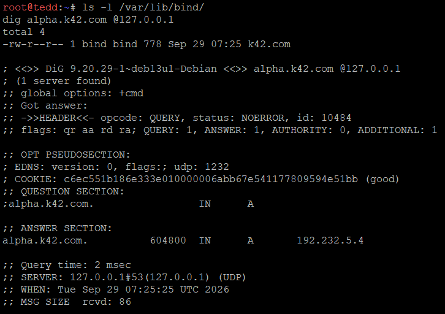

Disini terlihat bahwa status dari dig tersebut adalah `NOERROR` dan juga muncul ip dari alpha yang menandakan bahwa tedd berhasil mengikuti prab dan hasilnya terupdate. Dari sini juga terlihat bahwa domain dengan nama dari webnya juga berhasil di implementasi dilihat dari nama domainnya (untuk contoh ini alpha.k42.com) dan juga terlihat ip dari domainnya (yaitu 192.232.5.4)

## Soal 6

Setelah memastikan BIND9 sudah terpasang di `prab` dan `tedd`, cek file konfigurasi lokal BIND9 di `prab`. 
Pastikan `tedd` telah diberi izin untuk zone transfer. 

Jalankan:
```bash
dig @192.232.3.7 k42.com soa # Pada PRAB
dig @192.232.3.6 k42.com soa # Pada TEDD
```

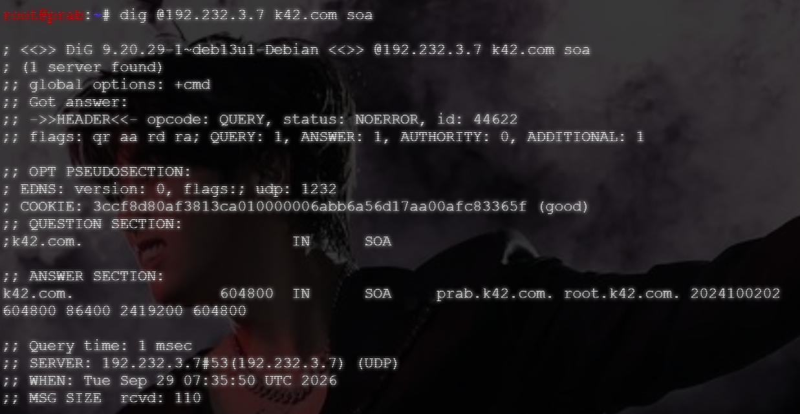
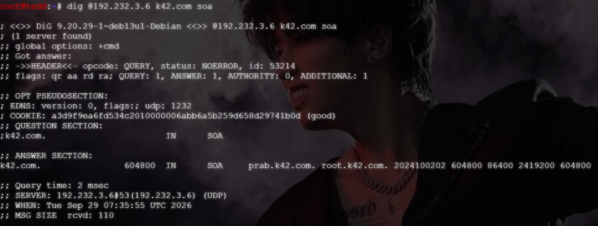

Dari hasil pengecekan tersebut, dapat dilihat bahwa nilai serial SOA dari `tedd` dan `prab` adalah sama, yakni dengan nilai `2024100202`.

## Soal 7

### Ubah SOA untuk container `prab`

Buatlah file, dan ganti isi file `soal7.sh` dengan script dibawah ini:

```bash
#!/bin/bash

# --- Bagian 1: Konfigurasi Options ---
cat << 'EOF' > /etc/bind/named.conf.options
options {
    directory "/var/cache/bind";
    forwarders { 192.168.122.1; };
    allow-query { any; };
    dnssec-validation no;
    listen-on-v6 { any; };
};
EOF

# --- Bagian 2: Konfigurasi Local Zone ---
cat << 'EOF' > /etc/bind/named.conf.local
zone "k42.com" {
    type master;
    notify yes;
    also-notify { 192.232.3.6; };
    allow-transfer { 192.232.3.6; };
    file "/etc/bind/jarkom/k42.com";
};
EOF

# --- Bagian 3: Pembuatan File Zona k42.com (Langkah 5, 6, dan 7) ---
mkdir -p /etc/bind/jarkom

cat << 'EOF' > /etc/bind/jarkom/k42.com
;
; BIND data file for k42.com
;
$TTL    604800
@       IN  SOA     prab.k42.com. root.k42.com. (
                        2024100203      ; Serial (Dinaikkan agar sync ke tedd)
                        604800          ; Refresh
                        86400           ; Retry
                        2419200         ; Expire
                        604800 )        ; Negative Cache TTL
;
@       IN  NS      prab.k42.com.
@       IN  NS      tedd.k42.com.

; --- A Record Seluruh Entitas ---
rootkit IN  A       192.232.1.1
delta   IN  A       192.232.1.2
epsilon IN  A       192.232.1.3
penny   IN  A       192.232.2.2
molly   IN  A       192.232.3.2
oblada  IN  A       192.232.3.3
desmond IN  A       192.232.3.4
obladi  IN  A       192.232.3.5
tedd    IN  A       192.232.3.6
prab    IN  A       192.232.3.7
abbey   IN  A       192.232.4.2
gamma   IN  A       192.232.5.2
beta    IN  A       192.232.5.3
alpha   IN  A       192.232.5.4

; --- A Record Load Balancing (Tahap 7) ---
vault   IN  A       192.232.3.5   ; IP Obladi
vault   IN  A       192.232.3.4   ; IP Desmond
core    IN  A       192.232.3.3   ; IP Oblada
core    IN  A       192.232.3.2   ; IP Molly

; --- CNAME Record (Tahap 7) ---
www     IN  CNAME   penny
static  IN  CNAME   abbey
EOF

# --- Bagian 4: Restart Layanan BIND9 ---
service named restart
service named status
echo "Konfigurasi DNS Master (Prab) Berhasil Dijalankan!"
```

Jika sudah, jalankan file yang sudah diubah tersebut dan restart layanan BIND9.

```bash
service named restart
service named status
```

### Verifikasi ke `tedd`

Jika sudah, jalankan `dig`.

``` bash
dig @192.232.3.6 k42.com soa
# Dianggap berhasil apabila nomor serialnya sudah sama.
```

### Uji Coba dari Dua Klien Berbeda

- Dari alpha

``` bash
dig @192.232.3.7 vault.k42.com
dig @192.232.3.7 core.k42.com
```

- Dari beta

``` bash
dig @192.232.3.7 vault.k42.com
dig @192.232.3.7 core.k42.com
```

### Bukti

- alpha

- beta


## Soal 8

"Di prab (master) deklarasikan reverse zone untuk segmen jaringan  tempat abbey, penny, area vault, dan area core berada. Di tedd (slave) tarik reverse zone tersebut sebagai slave, isi PTR untuk keempat hostname itu agar pencarian balik IP address mengembalikan hostname yang benar, lalu pastikan query reverse untuk alamat abbey, penny, area vault, dan area core dijawab authoritative."

### Setup Prab

Untuk memulai, kita pertama perlu untuk konfigurasi Prab terlebih dahulu. Pertama, kita perlu untuk mendeklarasikan reverse zonenya terlebih dahulu. Kita jalankan kode berikut.

```text
cat > /etc/bind/named.conf.local <<'EOF'
zone "k42.com" {
    type master;
    notify yes;
    also-notify { 192.232.3.6; };
    allow-transfer { 192.232.3.6; };
    file "/etc/bind/jarkom/k42.com";
};

zone "2.232.192.in-addr.arpa" {
    type master;
    notify yes;
    also-notify { 192.232.3.6; };
    allow-transfer { 192.232.3.6; };
    file "/etc/bind/jarkom/2.232.192.in-addr.arpa";
};

zone "3.232.192.in-addr.arpa" {
    type master;
    notify yes;
    also-notify { 192.232.3.6; };
    allow-transfer { 192.232.3.6; };
    file "/etc/bind/jarkom/3.232.192.in-addr.arpa";
};

zone "4.232.192.in-addr.arpa" {
    type master;
    notify yes;
    also-notify { 192.232.3.6; };
    allow-transfer { 192.232.3.6; };
    file "/etc/bind/jarkom/4.232.192.in-addr.arpa";
};
EOF
```

Lalu, kita perlu untuk membuat file zona dan kita isikan PTR.

```text
cat > /etc/bind/jarkom/2.232.192.in-addr.arpa <<'EOF'
$TTL    604800
@       IN      SOA     prab.k42.com. root.k42.com. (
                        2024100201      ; Serial
                        604800          ; Refresh
                        86400           ; Retry
                        2419200         ; Expire
                        604800 )        ; Negative Cache TTL
;
@       IN      NS      prab.k42.com.
@       IN      NS      tedd.k42.com.
2       IN      PTR     penny.k42.com.
EOF
```

```text
cat > /etc/bind/jarkom/3.232.192.in-addr.arpa <<'EOF'
$TTL    604800
@       IN      SOA     prab.k42.com. root.k42.com. (
                        2024100201      ; Serial
                        604800          ; Refresh
                        86400           ; Retry
                        2419200         ; Expire
                        604800 )        ; Negative Cache TTL
;
@       IN      NS      prab.k42.com.
@       IN      NS      tedd.k42.com.
5       IN      PTR     vault.k42.com.
4       IN      PTR     vault.k42.com.
3       IN      PTR     core.k42.com.
2       IN      PTR     core.k42.com.
EOF
```

```text
cat > /etc/bind/jarkom/3.232.192.in-addr.arpa <<'EOF'
$TTL    604800
@       IN      SOA     prab.k42.com. root.k42.com. (
                        2024100201      ; Serial
                        604800          ; Refresh
                        86400           ; Retry
                        2419200         ; Expire
                        604800 )        ; Negative Cache TTL
;
@       IN      NS      prab.k42.com.
@       IN      NS      tedd.k42.com.
5       IN      PTR     vault.k42.com.
4       IN      PTR     vault.k42.com.
3       IN      PTR     core.k42.com.
2       IN      PTR     core.k42.com.
EOF
```

```text
cat > /etc/bind/jarkom/4.232.192.in-addr.arpa <<'EOF'
$TTL    604800
@       IN      SOA     prab.k42.com. root.k42.com. (
                        2024100201      ; Serial
                        604800          ; Refresh
                        86400           ; Retry
                        2419200         ; Expire
                        604800 )        ; Negative Cache TTL
;
@       IN      NS      prab.k42.com.
@       IN      NS      tedd.k42.com.
2       IN      PTR     abbey.k42.com.
EOF
```

Setelah itu kita, mengecek dan restart.

```text
named-checkzone 2.232.192.in-addr.arpa /etc/bind/jarkom/2.232.192.in-addr.arpa
named-checkzone 3.232.192.in-addr.arpa /etc/bind/jarkom/3.232.192.in-addr.arpa
named-checkzone 4.232.192.in-addr.arpa /etc/bind/jarkom/4.232.192.in-addr.arpa
named-checkconf
service named restart
dig -x 192.232.2.2 @127.0.0.1 +short
dig -x 192.232.4.2 @127.0.0.1 +short
dig -x 192.232.3.5 @127.0.0.1 +short
dig -x 192.232.3.3 @127.0.0.1 +short
```


Disini sudah terlihat bahwa setiap zona menjawab dengan OK dengan serial ..201, named-checkconf tidak mengeluarkan error, dan keempat query reversenya terjawab dengan benar.

### Setup Tedd

Setelah selesai setup prab, kita setup dulu zona slavenya di dalam tedd. Kita jalankan berikut untuk menambahkannya.

```text
cat >> /etc/bind/named.conf.local <<'EOF'

zone "2.232.192.in-addr.arpa" {
    type slave;
    masters { 192.232.3.7; };
    file "/var/lib/bind/2.232.192.in-addr.arpa";
};

zone "3.232.192.in-addr.arpa" {
    type slave;
    masters { 192.232.3.7; };
    file "/var/lib/bind/3.232.192.in-addr.arpa";
};

zone "4.232.192.in-addr.arpa" {
    type slave;
    masters { 192.232.3.7; };
    file "/var/lib/bind/4.232.192.in-addr.arpa";
};
EOF
```

Setelah menjalankannya, kita mengecek dengan berikut.

```text
named-checkconf
service named restart
sleep 5
ls -l /var/lib/bind/
```


Dan terakhir kita verifikasi authorative di tedd.

```text
dig -x 192.232.2.2 @127.0.0.1
dig -x 192.232.4.2 @127.0.0.1
dig -x 192.232.3.5 @127.0.0.1
dig -x 192.232.3.3 @127.0.0.1
```

Hasilnya akan terlihat seperti berikut.

```text
root@tedd:~# dig -x 192.232.2.2 @127.0.0.1
dig -x 192.232.4.2 @127.0.0.1
dig -x 192.232.3.5 @127.0.0.1
dig -x 192.232.3.3 @127.0.0.1

; <<>> DiG 9.20.29-1~deb13u1-Debian <<>> -x 192.232.2.2 @127.0.0.1
; (1 server found)
;; global options: +cmd
;; Got answer:
;; ->>HEADER<<- opcode: QUERY, status: NOERROR, id: 63623
;; flags: qr aa rd ra; QUERY: 1, ANSWER: 1, AUTHORITY: 0, ADDITIONAL: 1

;; OPT PSEUDOSECTION:
; EDNS: version: 0, flags:; udp: 1232
; COOKIE: e55805a36db29e25010000006abcd2d454d12e3d5daf747a (good)
;; QUESTION SECTION:
;2.2.232.192.in-addr.arpa.      IN      PTR

;; ANSWER SECTION:
2.2.232.192.in-addr.arpa. 604800 IN     PTR     penny.k42.com.

;; Query time: 0 msec
;; SERVER: 127.0.0.1#53(127.0.0.1) (UDP)
;; WHEN: Wed Sep 30 09:13:56 UTC 2026
;; MSG SIZE  rcvd: 108


; <<>> DiG 9.20.29-1~deb13u1-Debian <<>> -x 192.232.4.2 @127.0.0.1
; (1 server found)
;; global options: +cmd
;; Got answer:
;; ->>HEADER<<- opcode: QUERY, status: NOERROR, id: 58497
;; flags: qr aa rd ra; QUERY: 1, ANSWER: 1, AUTHORITY: 0, ADDITIONAL: 1

;; OPT PSEUDOSECTION:
; EDNS: version: 0, flags:; udp: 1232
; COOKIE: e946b35d4f01765b010000006abcd2d4bb9fe4f83eae662b (good)
;; QUESTION SECTION:
;2.4.232.192.in-addr.arpa.      IN      PTR

;; ANSWER SECTION:
2.4.232.192.in-addr.arpa. 604800 IN     PTR     abbey.k42.com.

;; Query time: 0 msec
;; SERVER: 127.0.0.1#53(127.0.0.1) (UDP)
;; WHEN: Wed Sep 30 09:13:56 UTC 2026
;; MSG SIZE  rcvd: 108


; <<>> DiG 9.20.29-1~deb13u1-Debian <<>> -x 192.232.3.5 @127.0.0.1
; (1 server found)
;; global options: +cmd
;; Got answer:
;; ->>HEADER<<- opcode: QUERY, status: NOERROR, id: 55534
;; flags: qr aa rd ra; QUERY: 1, ANSWER: 1, AUTHORITY: 0, ADDITIONAL: 1

;; OPT PSEUDOSECTION:
; EDNS: version: 0, flags:; udp: 1232
; COOKIE: 0bf6183ec6bceb19010000006abcd2d4199487c1c99452fd (good)
;; QUESTION SECTION:
;5.3.232.192.in-addr.arpa.      IN      PTR

;; ANSWER SECTION:
5.3.232.192.in-addr.arpa. 604800 IN     PTR     vault.k42.com.

;; Query time: 0 msec
;; SERVER: 127.0.0.1#53(127.0.0.1) (UDP)
;; WHEN: Wed Sep 30 09:13:56 UTC 2026
;; MSG SIZE  rcvd: 108


; <<>> DiG 9.20.29-1~deb13u1-Debian <<>> -x 192.232.3.3 @127.0.0.1
; (1 server found)
;; global options: +cmd
;; Got answer:
;; ->>HEADER<<- opcode: QUERY, status: NOERROR, id: 58612
;; flags: qr aa rd ra; QUERY: 1, ANSWER: 1, AUTHORITY: 0, ADDITIONAL: 1

;; OPT PSEUDOSECTION:
; EDNS: version: 0, flags:; udp: 1232
; COOKIE: 8eaf0c3af18855db010000006abcd2d4fc6d2712071c7b4b (good)
;; QUESTION SECTION:
;3.3.232.192.in-addr.arpa.      IN      PTR

;; ANSWER SECTION:
3.3.232.192.in-addr.arpa. 604800 IN     PTR     core.k42.com.

;; Query time: 0 msec
;; SERVER: 127.0.0.1#53(127.0.0.1) (UDP)
;; WHEN: Wed Sep 30 09:13:56 UTC 2026
;; MSG SIZE  rcvd: 107
```

Terlihat semua statusnya NOERROR dan juga ada flag aa dan mengeluarkan alamat webnya masing-masing.

## Soal 9

### Jalankan script `obladi` dan `desmond`

Buat file script `soal9_obladi.sh` `soal9_desmond.sh` dan berikan izin eksekusi, kemudian jalankan. Pastikan Apache2 berhaasil running


### Uji akses via Hostname

Jalankan pengujian menggunakan `curl <domain>`, namun apabila node alpha belum terhubung dengan node `obladi`, maka bisa menggunakan `curl --resolve <domain>:80:<IP WEB SERVER> <domain>`

```bash
curl http://vault.k42.com/arsip/
```


## Soal 10

### Jalankan cript `oblada` dan `molly`

Buat file script `soal10_oblada.sh` `soal10_molly.sh` dan berikan izin eksekusi, kemudian jalankan. Pastikan Nginx berhaasil running.


### Uji curl `beranda` dan `profil`

Di dalam script untuk `oblada` dan `molly` terdapat pembuatan file `index.php` dan `profil.php`.

Jalankan dengan perintah `curl <domain>`,  namun apabila node alpha belum terhubung dengan node `oblada`, maka bisa menggunakan `curl --resolve <domain>:80:<IP WEB SERVER> <domain>`.

```bash
curl http://core.k42.com/
curl http://core.k42.com/profil
```


## Soal 11

### Jalankan script `abbey` dan `penny`

Buat file `soal11_abbey.sh` dan `soal11_penny.sh` di masing-masing container, berikan izin eksekusi dan jalankan.


Pada container `prab`, buatlah `soal11_prab.sh` dan sesuaikan isinya dengan script yang telah dibuat. Berikan izin eksekusi dan jalankan. Jangan lupa lakukan **reload** agar tidak tertumpuk BIND9-nya.


### Konfigurasi nameserver

Pada node `penny` dan `abbey`, tambahkan nameserver 192.232.3.7 dan nameserver 8.8.8.8 agar bisa melakukan uji coba di tahap selanjutnya.

**Catatan**
Untuk `nameserver 8.8.8.8` harus diletakkan di paling belakang.

```bash
# Milik penny
up echo -e 'nameserver 192.232.3.7\nnameserver 192.232.3.5\nnameserver 192.232.3.4\nnameserver 192.168.122.1\nnameserver 8.8.8.8' > /etc/resolv.conf

# Milik abbey
up echo -e 'nameserver 192.232.3.7\nnameserver 192.232.3.3\nnameserver 192.232.3.2\nnameserver 192.168.122.1\nnameserver 8.8.8.8' > /etc/resolv.conf
```

### Uji Coba

- Uji coba di `alpha`

    Buka container `alpha` dan lakukan `dig vault.k42.com +short` dan `dig core.k42.com +short`. Pastikan output yang diberikan adalah IP dari `abbey` dan `penny`.

    

- Uji coba di `penny`

    Buka container `penny` dan pastikan apache2 sedang running. Kemudian jalankan `curl -v http://vault.k42.com/arsip/`. Jika sudah benar, maka outputnya adalahh isi dari file yang telah dibuat.

      

- Uji coba di `abbey`

    Buka container `abbey` dan pastikan Nginx sedang berjalan. Kemudian jalankan `curl -v http://core.k42.com/` dan `curl -v http://core.k42.com/profil`.

    
    

## Soal 12

""Terdapat ruang khusus di penny yang yang menyimpan dokumen rahasia sindikat, oleh karena itu terapkan perlindungan basic authentication untuk path /admin. Akses ke jalur tersebut harus menolak pengunjung tanpa kredensial, dan hanya mengizinkan masuk jika menggunakan credential berikut:"

|username|password|
|---|---|
|prabs|pakar_pinter_jadi_gob***|

Penny adalah reverse proxy (Apache) yang meneruskan trafik ke area vault (Obladi & Desmond). Karena itu, basic authentication kita pasang di penny pada path /admin, sehingga setiap pengunjung akan dicek kredensialnya terlebih dahulu sebelum request diteruskan ke backend.

### Setup Penny
Pertama, kita perlu membuat file kredensial yang berisi user prabs beserta passwordnya. Password akan disimpan dalam bentuk hash. Tools htpasswd berasal dari paket apache2-utils.

```
apt update
apt install apache2-utils -y

htpasswd -cb /etc/apache2/.htpasswd prabs 'pakar_pinter_jadi_gob***'
cat /etc/apache2/.htpasswd
```

Setelah menjalankannya, hasilnya akan seperti berikut.
```
root@penny:~# apt update
Hit:1 http://deb.debian.org/debian trixie InRelease
Hit:2 http://deb.debian.org/debian trixie-updates InRelease
Hit:3 http://deb.debian.org/debian-security trixie-security InRelease
27 packages can be upgraded. Run 'apt list --upgradable' to see them.
root@penny:~# apt install apache2-utils -y
apache2-utils is already the newest version (2.4.68-1~deb13u1).
apache2-utils set to manually installed.
Summary:
  Upgrading: 0, Installing: 0, Removing: 0, Not Upgrading: 27
root@penny:~#
root@penny:~# htpasswd -cb /etc/apache2/.htpasswd prabs 'pakar_pinter_jadi_gob***'
Adding password for user prabs
root@penny:~# cat /etc/apache2/.htpasswd
prabs:$apr1$N7cftK7b$NBm2bZgDs7.Lw8GCR5VSq/
```

Password perlu diapit dengan kutip satu supaya tanda *** tidak dianggap wildcard oleh shell. Opsi -c membuat file baru, jadi opsi ini tidak perlu dipakai lagi jika ingin menambah user lain.

Disini terlihat bahwa file .htpasswd berhasil dibuat dan isinya berbentuk prabs:$apr1$..., yang menandakan password sudah ter-hash.

Lalu, kita tambahkan aturan autentikasi ke dalam konfigurasi reverse proxy yang sudah dibuat sebelumnya, yaitu /etc/apache2/sites-available/vault-proxy.conf. Kita tambahkan blok <Location "/admin"> di dalam <VirtualHost>.
```
sed -i 's|</VirtualHost>|\n    <Location "/admin">\n        AuthType Basic\n        AuthName "Ruang Rahasia Sindikat"\n        AuthUserFile /etc/apache2/.htpasswd\n        Require valid-user\n    </Location>\n</VirtualHost>|' /etc/apache2/sites-available/vault-proxy.conf
```

Setelah dijalankan, hasilnya akan terlihat sebagai berikut.
```
root@penny:~# sed -i 's|</VirtualHost>|\n    <Location "/admin">\n        AuthType Basic\n        AuthName "Ruang Rahasia Sindikat"\n        AuthUserFile /etc/apache2/.htpasswd\n        Require valid-user\n    </Location>\n</VirtualHost>|' /etc/apache2/sites-available/vault-proxy.conf
root@penny:~# cat /etc/apache2/sites-available/vault-proxy.conf
<VirtualHost *:80>
    ServerName vault.k42.com
    ServerAlias www.k42.com k42.com penny.k42.com

    # Konfigurasi Load Balancer untuk Obladi & Desmond
    <Proxy balancer://vaultcluster>
        BalancerMember http://192.232.3.5
        BalancerMember http://192.232.3.4
        ProxySet lbmethod=byrequests
    </Proxy>

    # Forwarding traffic
    ProxyPass / balancer://vaultcluster/
    ProxyPassReverse / balancer://vaultcluster/

    # Meneruskan header Host dan X-Real-IP (Wajib)
    ProxyPreserveHost On
    RequestHeader set X-Real-IP "%{REMOTE_ADDR}s"

    <Location "/admin">
        AuthType Basic
        AuthName "Ruang Rahasia Sindikat"
        AuthUserFile /etc/apache2/.htpasswd
        Require valid-user
    </Location>

    <Location "/admin">
        AuthType Basic
        AuthName "Ruang Rahasia Sindikat"
        AuthUserFile /etc/apache2/.htpasswd
        Require valid-user
    </Location>
</VirtualHost>
```

Setelah itu, kita aktifkan modul autentikasinya, mengecek konfigurasi, dan restart Apache.
```
a2enmod auth_basic authn_file authz_user
apachectl configtest
service apache2 restart
```

Setelah dijalankan, hasilnya seperti berikut.
```
root@penny:~# a2enmod auth_basic authn_file authz_user
apachectl configtest
service apache2 restart
Considering dependency authn_core for auth_basic:
Module authn_core already enabled
Module auth_basic already enabled
Module authn_file already enabled
Considering dependency authz_core for authz_user:
Module authz_core already enabled
Module authz_user already enabled
Syntax OK
Restarting Apache httpd web server: apache2.
```

Disini terlihat bahwa apachectl configtest menampilkan Syntax OK dan Apache berhasil di-restart.

### Testing & Verifikasi
Supaya setelah login pengunjung mendapatkan isi halaman, kita buat folder /admin di backend area vault. Jalankan berikut di Obladi dan Desmond.
```
mkdir -p /var/www/html/admin
echo "<h1>Dokumen Rahasia Sindikat</h1>" > /var/www/html/admin/index.html
```

Langkah ini tidak wajib untuk membuktikan autentikasi. Tanpa halaman ini, kredensial yang benar tetap lolos dari penny, hanya saja backend akan menjawab 404 Not Found.

Lalu, untuk melakukan verifikasi, pengujian dilakukan dari klien (alpha) dan wajib lewat hostname, bukan IP. Kita coba tiga skenario: tanpa kredensial, dengan password yang salah, dan dengan kredensial yang benar. Terakhir, kita cek path lain tetap bisa diakses tanpa login.
```
curl -i http://www.k42.com/admin/
curl -i -u 'prabs:salah' http://www.k42.com/admin/
curl -i -u 'prabs:pakar_pinter_jadi_gob***' http://www.k42.com/admin/
curl -sI http://www.k42.com/ | head -n 1
```

Setelah dijalankan, hasilnya akan terlihat sebagai berikut.
```
root@alpha:~# curl -i http://www.k42.com/admin/
curl -i -u 'prabs:salah' http://www.k42.com/admin/
curl -i -u 'prabs:pakar_pinter_jadi_gob***' http://www.k42.com/admin/
curl -sI http://www.k42.com/ | head -n 1
HTTP/1.1 401 Unauthorized
Date: Wed, 30 Sep 2026 15:14:38 GMT
Server: Apache/2.4.68 (Debian)
WWW-Authenticate: Basic realm="Area Rahasia Sindikat"
Content-Length: 498
Content-Type: text/html; charset=iso-8859-1

<!DOCTYPE HTML PUBLIC "-//W3C//DTD HTML 4.01//EN" "http://www.w3.org/TR/html4/st                                                                                                                                                                             rict.dtd">
<html><head>
<title>401 Unauthorized</title>
</head><body>
<h1>Unauthorized</h1>
<p>This server could not verify that you
are authorized to access the document
requested.  Either you supplied the wrong
credentials (e.g., bad password), or your
browser doesn't understand how to supply
the credentials required.</p>
<hr>
<address>Apache/2.4.68 (Debian) Server at www.k42.com Port 80</address>
</body></html>
HTTP/1.1 401 Unauthorized
Date: Wed, 30 Sep 2026 15:14:38 GMT
Server: Apache/2.4.68 (Debian)
WWW-Authenticate: Basic realm="Area Rahasia Sindikat"
Content-Length: 498
Content-Type: text/html; charset=iso-8859-1

<!DOCTYPE HTML PUBLIC "-//W3C//DTD HTML 4.01//EN" "http://www.w3.org/TR/html4/st                                                                                                                                                                             rict.dtd">
<html><head>
<title>401 Unauthorized</title>
</head><body>
<h1>Unauthorized</h1>
<p>This server could not verify that you
are authorized to access the document
requested.  Either you supplied the wrong
credentials (e.g., bad password), or your
browser doesn't understand how to supply
the credentials required.</p>
<hr>
<address>Apache/2.4.68 (Debian) Server at www.k42.com Port 80</address>
</body></html>
HTTP/1.1 200 OK
Date: Wed, 30 Sep 2026 15:14:38 GMT
Server: Apache/2.4.68 (Debian)
Last-Modified: Wed, 30 Sep 2026 14:30:18 GMT
ETag: "22-65cb423727f86"
Accept-Ranges: bytes
Content-Length: 34
Content-Type: text/html

<h1>Dokumen Rahasia Sindikat</h1>
HTTP/1.1 200 OK
```

Disini terlihat bahwa akses ke /admin tanpa kredensial maupun dengan password yang salah ditolak dengan status 401 Unauthorized beserta header WWW-Authenticate: Basic. Sementara itu, akses dengan user prabs dan password yang benar berhasil masuk dengan status 200 OK dan menampilkan isi halaman Dokumen Rahasia Sindikat. Path lain seperti / tetap bisa diakses tanpa login, yang menandakan proteksi hanya berlaku di path /admin.

## Soal 13

### Jalankan script `abbey` dan `penny`

Buatlah file `soal13_abbey.sh` dan `soal13_penny.sh` di masing-masing container. Berikan izin eksekusi dan jalankan.

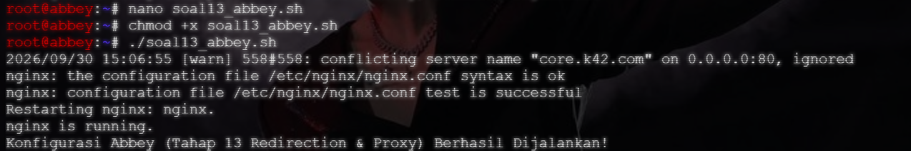


### Uji coba di `penny`

Setelah memastikan script berjalan tanpa kendala, lakukan uji coba di `alpha`.

- Curl ke `abbey`

    ```bash
    curl http://192.232.4.2/
    curl http://abbey.k42.com/
    ```

    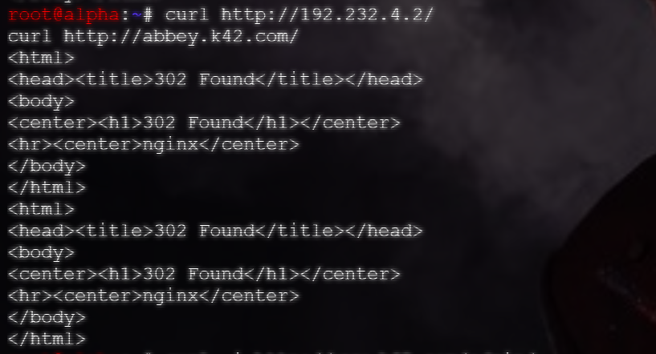

- Curl ke `penny`

    ```bash
    curl http://192.232.2.2/
    curl http://penny.k42.com/
    ```

    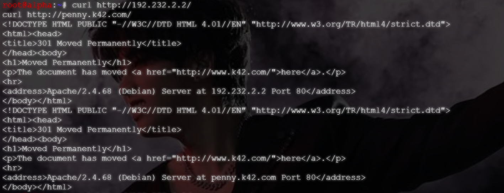

## Soal 14

"Di dalam The Mesh, rekam jejak tidak boleh dipalsukan oleh sistem. Pastikan access log pada setiap server web di area vault maupun area core mencatat alamat IP asli milik client (pengunjung) yang diteruskan oleh gerbang, dan bukan mencatat IP dari Penny ataupun Abbey."

Untuk mengerjakan soal ini, pertama kita perlu mengedit k.k42.com.conf dari Penny supaya X-Real-IP kembali dikirim, lalu di restart. Untuk melakukannya, jalankan kode berikut.

### Setup Penny

```bash
a2enmod headers

# Sisipkan header setelah ProxyPreserveHost di VirtualHost www/vault
sed -i '/ProxyPreserveHost On/a\    RequestHeader set X-Real-IP "expr=%{REMOTE_ADDR}"' /etc/apache2/sites-available/k42.com.conf

apache2ctl configtest
service apache2 restart
```

Setelah menjalankan kodenya, akan muncul seperti berikut.

```text
root@penny:~# a2enmod headers

# Sisipkan header setelah ProxyPreserveHost di VirtualHost www/vault
sed -i '/ProxyPreserveHost On/a\    RequestHeader set X-Real-IP "expr=%{REMOTE_A                                                                                                                                                                             DDR}"' /etc/apache2/sites-available/k42.com.conf

apache2ctl configtest
service apache2 restart
Module headers already enabled
Syntax OK
Restarting Apache httpd web server: apache2.
```

Dari kode ini, set menimpa header apa pun yang dikirim client, jadi client tidak bisa memalsukan X-Real-IP. Apache juga otomatis menambahkan X-Forwarded-For lewat mod_proxy_http.

Penny sudah selesai di setup, terlihat dari modul headers aktif, sintaks OK, dan Apache berhasil restart. Tetapi karena sed tidak menampilkan output, pastikan dulu barisnya benar-benar masuk

```bash
grep -n -B1 -A1 "X-Real-IP" /etc/apache2/sites-available/k42.com.conf
```

Jika berhasil, maka hasilnya akan seperti berikut.

```text
root@penny:~# grep -n -B1 -A1 "X-Real-IP" /etc/apache2/sites-available/k42.com.conf
15-    ProxyPreserveHost On
16:    RequestHeader set X-Real-IP "expr=%{REMOTE_ADDR}"
17-
```

Disini terlihat munculnya line 'RequestHeader ...' yang berarti sudah berjalan dengan sukses.

### Setup Obladi dan Desmond

Setelah selesai setup Penny, kita baru setup Obladi dan Desmond dengan menggunakan kode berikut.

```bash
a2enmod remoteip

cat << 'EOF' > /etc/apache2/conf-available/remoteip.conf
RemoteIPHeader X-Real-IP
RemoteIPInternalProxy 192.232.2.2
EOF
a2enconf remoteip

# Vhost k42.conf belum punya CustomLog, jadi tambahkan supaya access.log terisi
grep -q CustomLog /etc/apache2/sites-available/k42.conf || \
sed -i '/DocumentRoot/a\    CustomLog ${APACHE_LOG_DIR}/access.log combined' /etc/apache2/sites-available/k42.conf

apache2ctl configtest
service apache2 restart
```

Hasilnya akan terlihat sebagai berikut di keduanya masing-masing.

```text
root@obladi:~# a2enmod remoteip

cat << 'EOF' > /etc/apache2/conf-available/remoteip.conf
RemoteIPHeader X-Real-IP
RemoteIPInternalProxy 192.232.2.2
EOF
a2enconf remoteip

grep -q CustomLog /etc/apache2/sites-available/k42.conf || \
sed -i '/DocumentRoot/a\    CustomLog ${APACHE_LOG_DIR}/access.log combined' /etc/apache2/sites-available/k42.conf

apache2ctl configtest
service apache2 restart
Enabling module remoteip.
To activate the new configuration, you need to run:
  service apache2 restart
Enabling conf remoteip.
To activate the new configuration, you need to run:
  service apache2 reload
AH00558: apache2: Could not reliably determine the server's fully qualified domain name, using 127.0.1.1. Set the 'ServerName' directive globally to suppress this message
Syntax OK
Restarting Apache httpd web server: apache2AH00558: apache2: Could not reliably determine the server's fully qualified domain name, using 127.0.1.1. Set the 'ServerName' directive globally to suppress this message
.
```

```text
root@desmond:~# a2enmod remoteip

cat << 'EOF' > /etc/apache2/conf-available/remoteip.conf
RemoteIPHeader X-Real-IP
RemoteIPInternalProxy 192.232.2.2
EOF
a2enconf remoteip

grep -q CustomLog /etc/apache2/sites-available/k42.conf || \
sed -i '/DocumentRoot/a\    CustomLog ${APACHE_LOG_DIR}/access.log combined' /etc/apache2/sites-available/k42.conf

apache2ctl configtest
service apache2 restart
Module remoteip already enabled
Conf remoteip already enabled
AH00558: apache2: Could not reliably determine the server's fully qualified domain name, using 127.0.1.1. Set the 'ServerName' directive globally to suppress this message
Syntax OK
Restarting Apache httpd web server: apache2AH00558: apache2: Could not reliably determine the server's fully qualified domain name, using 127.0.1.1. Set the 'ServerName' directive globally to suppress this message
.
```

Terlihat line Syntax OK yang berarti config berhasil.

### Verifikasi Logs

Setelah selesai setup, kita baru bisa mengetes secara cepat dari client lain untuk mengecek apakah Obladi dan Desmond tersebut dapat melihat file access.log di curl. Untuk melakukannya, kita mencoba tesnya di dalam node Alpha dan menjalankan berikut

```bash
curl -s -o /dev/null -w "%{http_code}\n" http://vault.k42.com/
```

Sekaligus kita menjalankan kode ini di Alpha, kita jalankan

```bash
tail -f /var/log/apache2/access.log
```

Di Obladi dan Desmond. Dikarenakan file Alpha berada pada IP 192.232.5.4, maka logs yang tercatat harus dari IP tersebut. Jika berhasil untuk ditangkap, maka hasilnya akan sebagai berikut.

```text
root@obladi:~# tail -f /var/log/apache2/access.log
192.232.5.4 - - [30/Sep/2026:15:41:35 +0000] "GET / HTTP/1.1" 200 11013 "-" "curl/8.14.1"
192.232.5.4 - - [30/Sep/2026:15:41:36 +0000] "GET / HTTP/1.1" 200 11013 "-" "curl/8.14.1"
192.232.5.4 - - [30/Sep/2026:15:43:33 +0000] "GET / HTTP/1.1" 200 11014 "-" "curl/8.14.1"
192.232.5.4 - - [30/Sep/2026:15:43:36 +0000] "GET / HTTP/1.1" 200 11013 "-" "curl/8.14.1"
192.232.5.4 - - [30/Sep/2026:15:43:36 +0000] "GET / HTTP/1.1" 200 11014 "-" "curl/8.14.1"
192.232.5.4 - - [30/Sep/2026:15:43:37 +0000] "GET / HTTP/1.1" 200 11013 "-" "curl/8.14.1"
192.232.5.4 - - [30/Sep/2026:15:59:14 +0000] "GET / HTTP/1.1" 200 11014 "-" "curl/8.14.1"
192.232.5.4 - - [30/Sep/2026:15:59:14 +0000] "GET / HTTP/1.1" 200 11013 "-" "curl/8.14.1"
192.232.5.4 - - [30/Sep/2026:15:59:49 +0000] "GET / HTTP/1.1" 200 11014 "-" "curl/8.14.1"
192.232.5.4 - - [30/Sep/2026:15:59:49 +0000] "GET / HTTP/1.1" 200 11013 "-" "curl/8.14.1"
192.232.5.4 - - [30/Sep/2026:16:50:56 +0000] "GET / HTTP/1.1" 200 11014 "-" "curl/8.14.1"
192.232.5.4 - - [30/Sep/2026:16:51:02 +0000] "GET / HTTP/1.1" 200 11014 "-" "curl/8.14.1"
192.232.5.4 - - [30/Sep/2026:16:51:07 +0000] "GET / HTTP/1.1" 200 11014 "-" "curl/8.14.1"
^C

root@desmond:~# tail -f /var/log/apache2/access.log
192.232.5.4 - - [30/Sep/2026:15:59:14 +0000] "GET / HTTP/1.1" 200 11014 "-" "curl/8.14.1"
192.232.5.4 - - [30/Sep/2026:15:59:15 +0000] "GET / HTTP/1.1" 200 11013 "-" "curl/8.14.1"
192.232.5.4 - - [30/Sep/2026:15:59:49 +0000] "GET / HTTP/1.1" 200 11014 "-" "curl/8.14.1"
192.232.5.4 - - [30/Sep/2026:15:59:49 +0000] "GET / HTTP/1.1" 200 11013 "-" "curl/8.14.1"
192.232.5.4 - - [30/Sep/2026:16:50:58 +0000] "GET / HTTP/1.1" 200 11014 "-" "curl/8.14.1"
192.232.5.4 - - [30/Sep/2026:16:51:05 +0000] "GET / HTTP/1.1" 200 11014 "-" "curl/8.14.1"
192.232.5.4 - - [30/Sep/2026:16:51:48 +0000] "GET / HTTP/1.1" 200 11014 "-" "curl/8.14.1"
192.232.5.4 - - [30/Sep/2026:16:52:00 +0000] "GET / HTTP/1.1" 200 11014 "-" "curl/8.14.1"
192.232.5.4 - - [30/Sep/2026:16:52:03 +0000] "GET / HTTP/1.1" 200 11014 "-" "curl/8.14.1"
192.232.5.4 - - [30/Sep/2026:16:52:05 +0000] "GET / HTTP/1.1" 200 11013 "-" "curl/8.14.1"
^C
```

Disini terlihat bahwa Obladi dan Desmond berhasil untuk menangkap access.log yang di cull oleh Alpha, yaitu IP 192.232.5.4.

## Soal 15

### Jalankan Script `abbey` dan `penny`

Buat file `soal15_penny.sh` dan `soal15_abbey.sh` di masing-masing container. Berikan izin eksekusi dan jalankan. Pastikan Apache2 running di PENNY dan Nginx running di ABBEY.

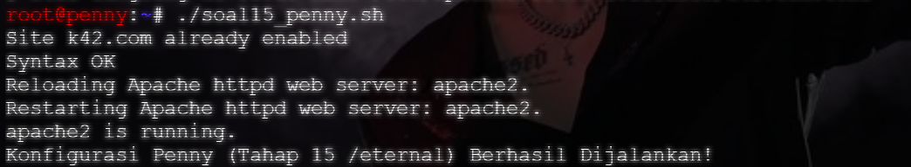
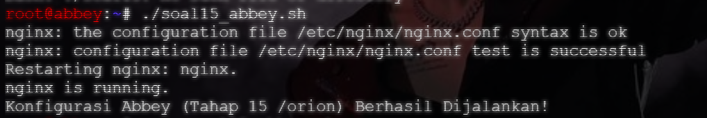

### Uji Coba di `alpha`

Apabila pada container `abbey` dan `penny` tertera bahwa Apache2 dan Nginx telah running, bisa dilanjutkan dengan pengecekan Path `/eternal` di `penny` sebagai PHP Rendering, sementara lakukan pengecekan path `/orion` di `abbey` yang merupakan murni statis. 

Pada container `alpha`, jalankan `curl -i http://www.k42.com/eternal/` dengan harapan:

1. Status HTTP = 200 OK
2. Output text = `Eternal PHP Active on Penny!`
3. Tidak terlihat kode `<?php ... ?>`

Selanjutnya di container yang sama, jalankan `curl -i http://static.k42.com/orion/ hasil yang diharapkan adalah:

1. Status HTTP = 200 OK
2. Output text = `<h1>Orion Static Page on Abbey</h1>`
3. File yang berformat `.php` tidak akan dieksekusi.

- Curl `/eternal`
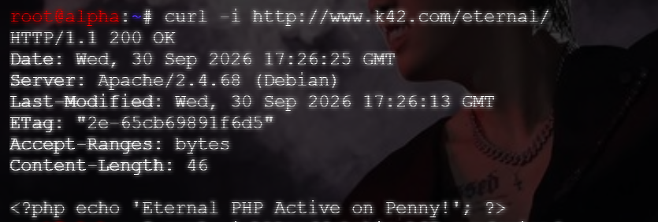

- Curl `/orion`
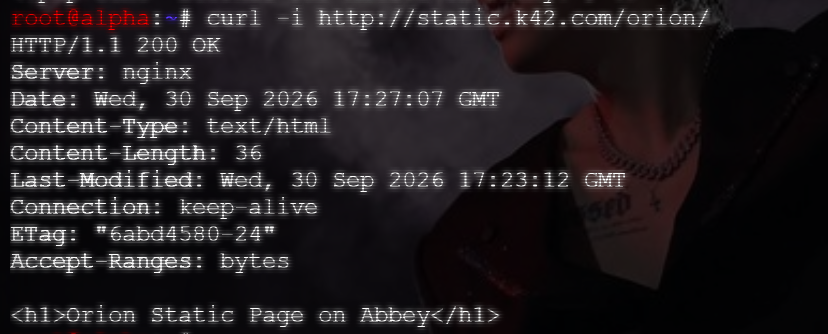

#### Catatan

Apabila link dari `http://...` kurang, maka status HTTP akan mengeluarkan kode 301 (Moved Permanently).

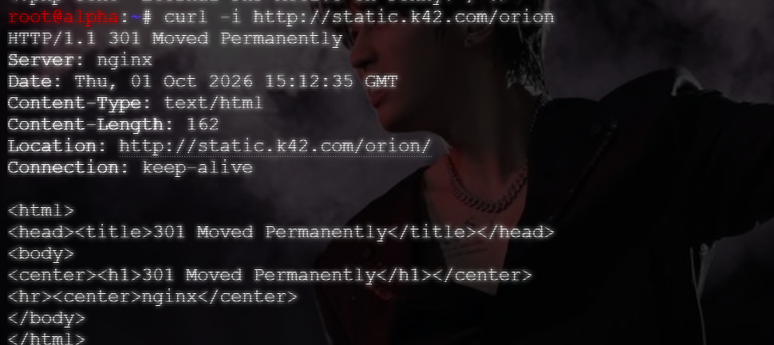

## Soal 16

Soal 16 berfokus pada pengujian atau *stress test server* menggunakan perintah ab (ApacheBench) pada `www.k42.com` dan `static.k42.com`.

### Persiapan

Sebelum melakukan uji coba, pastikan Nginx running di `abbey` dan Apache2 running di `penny`.


Selain itu, pastikan pula container `alpha` sudah terinstal ApacheBench (ab). Namun jika belum ter-install, cukup jalankan file `soal16_alpha.sh`.


### Uji Coba

Masuk ke container `alpha` dan jalankan perintah untuk melakukan *stress test*.

```bash
# untuk static.k42.com
ab -n 250 -c 10 http://static.k42.com/

# untuk www.k42.com
ab -n 250 -c 10 http://www.k42.com/
```

- ApacheBench `www.k42.com`


- ApacheBench `static.k42.com`


### Rangkuman

Dari hasil data yang telah didapatkan dengan menggunakan perintah ApacheBench (ab), dapat disimpulkan bahwa:

1. *Stress Test* pada `penny`
    > Dari hasil test diketahui bahwa total 250 request tidak ada yang gagal atau *no failed request* dengan waktu per *request*-nya 6.270 ms.

    >Data disini juga menampilkan bahwa *request per second*-nya adalah 1594.96 dan memiliki min = 4ms, mean = 6ms, dan max = 12ms.
2. *Stress Test* pada `abbey`
    > Dari hasil test diketahui bahwa dengan total 250 paket, tidak ada yang gagak atau *no failed request* dengan waktu per *request*-nya lebih cepat dibandingkan dari `penny`, yakni sebesar 5.155ms.

    > Data juga menampulkan bahwa *request per second*-nya sebesar 1939.86 dengan min = 3ms, mean = 5ms, dan max = 9ms.

## Soal 17

"Tambahkan TXT record pada DNS untuk semua klien sayap kiri dan sayap kanan (Alpha, Beta, Gamma, Delta, Epsilon). Jika DNS di-query TXT terhadap nama domain mereka (contoh: alpha.<xxxx>.com), sistem harus mengembalikan teks berupa nama hostname mereka masing-masing (contoh: "alpha")."

### Setup Prab
Jalankan berikut untuk mengecek serial zona sekarang
```
grep -A1 "Serial" /etc/bind/jarkom/k42.com
```

Dari sini terlihat bahwa untuk sekarang, serial zonanya adalah sebagai berikut.
```
root@prab:~# grep -A1 "Serial" /etc/bind/jarkom/k42.com
                        2024100205      ; Serial
                        604800          ; Refresh

```

Berikut, kita tambahkan record kepada zona dengan kode berikut.
```
cat >> /etc/bind/jarkom/k42.com <<'EOF'

; --- TXT Record Klien Sayap Kiri dan Kanan ---
alpha   IN  TXT     "alpha"
beta    IN  TXT     "beta"
gamma   IN  TXT     "gamma"
delta   IN  TXT     "delta"
epsilon IN  TXT     "epsilon"
EOF
```

Setelah itu, kita naikkan serial supaya tedd menarik ulang.
```
sed -i 's/2024100205/2024100206/' /etc/bind/jarkom/k42.com
grep -A1 "Serial" /etc/bind/jarkom/k42.com
```

Setelah menjalankan itu, serial zona sekarang akan menjadi 206.
```
root@prab:~# sed -i 's/2024100205/2024100206/' /etc/bind/jarkom/k42.com
grep -A1 "Serial" /etc/bind/jarkom/k42.com
                        2024100206      ; Serial
                        604800          ; Refresh
```

Lalu, kita restart dan verifikasi hasilnya.
```
named-checkzone k42.com /etc/bind/jarkom/k42.com
named-checkconf
service named restart
dig TXT alpha.k42.com @127.0.0.1 +short
```

Hasilnya harusnya seperti berikut.
```
root@prab:~# named-checkzone k42.com /etc/bind/jarkom/k42.com
named-checkconf
service named restart
dig TXT alpha.k42.com @127.0.0.1 +short
zone k42.com/IN: loaded serial 2024100206
OK
Stopping domain name service...: namedwaiting for pid 137 to die
.
Starting domain name service...: named.
"alpha"
```

Serial harus 206, named-checkzone harus berakhir OK, dan dig terakhir menampilkan "alpha".

### Verifikasi Tedd
Setelah selesai setup prab, kita verifikasi dulu di tedd apakah tedd sudah ikut terupdate atau belum
```
dig k42.com SOA @127.0.0.1 +short
```

```
root@tedd:~# dig k42.com SOA @127.0.0.1 +short
prab.k42.com. root.k42.com. 2024100206 604800 86400 2419200 604800
```
Disini terlihat serial berhasil terupdate menjadi 206.

Dan untuk mengecek apakah TXT record berhasil, jalankan berikut.
```
dig TXT beta.k42.com @127.0.0.1 +short
dig TXT gamma.k42.com @127.0.0.1 +short
dig TXT delta.k42.com @127.0.0.1 +short
dig TXT epsilon.k42.com @127.0.0.1 +short
```

Jika benar dan berhasil, hasilnya seperti ini
```
root@tedd:~# dig TXT beta.k42.com @127.0.0.1 +short
dig TXT gamma.k42.com @127.0.0.1 +short
dig TXT delta.k42.com @127.0.0.1 +short
dig TXT epsilon.k42.com @127.0.0.1 +short
"beta"
"gamma"
"delta"
"epsilon"
```

### Verifikasi Tambahan
Dan untuk verifikasi terakhir, kita jalankan juga di node Alpha, Beta, dst.
```
dig TXT alpha.k42.com +short
dig TXT beta.k42.com +short
dig TXT gamma.k42.com +short
dig TXT delta.k42.com +short
dig TXT epsilon.k42.com +short
dig alpha.k42.com +short
```

Node Alpha
```
root@alpha:~# dig TXT alpha.k42.com +short
dig TXT beta.k42.com +short
dig TXT gamma.k42.com +short
dig TXT delta.k42.com +short
dig TXT epsilon.k42.com +short
dig alpha.k42.com +short
"alpha"
"beta"
"gamma"
"delta"
"epsilon"
192.232.5.4
```

Node Beta
```
root@beta:~# dig TXT alpha.k42.com +short
dig TXT beta.k42.com +short
dig TXT gamma.k42.com +short
dig TXT delta.k42.com +short
dig TXT epsilon.k42.com +short
dig alpha.k42.com +short
"alpha"
"beta"
"gamma"
"delta"
"epsilon"
192.232.5.4
```

Node Gamma
```
root@gamma:~# dig TXT alpha.k42.com +short
dig TXT beta.k42.com +short
dig TXT gamma.k42.com +short
dig TXT delta.k42.com +short
dig TXT epsilon.k42.com +short
dig alpha.k42.com +short
"alpha"
"beta"
"gamma"
"delta"
"epsilon"
192.232.5.4
```

Node Delta
```
root@delta:~# dig TXT alpha.k42.com +short
dig TXT beta.k42.com +short
dig TXT gamma.k42.com +short
dig TXT delta.k42.com +short
dig TXT epsilon.k42.com +short
dig alpha.k42.com +short
"alpha"
"beta"
"gamma"
"delta"
"epsilon"
192.232.5.4
```

Node Epsilon
```
root@epsilon:~# dig TXT alpha.k42.com +short
dig TXT beta.k42.com +short
dig TXT gamma.k42.com +short
dig TXT delta.k42.com +short
dig TXT epsilon.k42.com +short
dig alpha.k42.com +short
"alpha"
"beta"
"gamma"
"delta"
"epsilon"
192.232.5.4
```

## Soal 18

### Setup container `prab`

Sebelum menyelesaikan soal 18, ubah A rcord dari `abbey.k42.com` menjadi IP fiktif dan memastikan TTL-nya 15 detik. Selain itu perlu juga menaikkan serial SOA pada file.

Cari baris `abbey` dan ubah IP serta tambahkan TTL menadi 15 detik.

```text
abbey   15  IN  A   192.232.4.78
```

Setelahnya, pastikan nomor serial SOA sudah **berganti**.


### Uji Coba 18

Untuk melakukan uji coba, perlu merestart dan melakukan dig secara bersamaan di dua terminal yang berbeda.

Sebelum BIND9 di-restart, pastikan IP Address dari `abbey` masih `192.232.4.2` dan belum berganti ke IP fiktif.


Selanjutnya, restart BIND9 di container `alpha` dan langsung jalankan dig pada `alpha` untuk melihat perubahan pada IP Address `abbey`.


## Soal 19

### Setup pada `prab`

Masuk ke file /etc/bind/jarkom/k42.com. Kemudian naikkan serial SOA di bagian atas file zone sebanyak 1 angka saja. Selanjutnya input baris CNAME di bagian bawah file:

```text
outbound      IN      CNAME   badssl.com.
```


Apabila telah selesai, maka lakukan restart dan cek statusnya apakah sudah berjalan atau belum.

```bash
named-checkzone k42.com /etc/bind/jarkom/k42.co
service named restart
service named status
```

**CATATAN**
Jangan lupa cek pula pada container `tedd`. Pastikan zona melakukan *zone transfer* dengan sukses agar SOA dapat tersinkronisasi.

### Uji Coba

Masuk ke container `alpha` dan lakukan uji coba ke `outbound.k42.com` dengan menggunakan curl.

```bash
curl -i http://outbound.k42.com/
```

Dengan melakukan uji coba ini, output yang diharapkan adalah:

1. Status HTTP = 200 OK (biasanya)
2. `curl` yang menampilkan isi halaman web `badssl.com`.


## Soal 20

"Setelah semua penyelesaian selesai, pastikan semua service dan konfigurasi yang telah dikerjakan dari awal tetap berjalan normal dan berstatus autostart saat node di-restart (khusus untuk kasus ini, abaikan konfigurasi nomor 18 dan biarkan koordinat kembali normal)."

Untuk soal nomor 20 ini kita cukup untuk abaikan konfigurasi nomor 18 terlebih dahulu dan membiarkan koordinatnya kembali ke normal.

Setelah itu, kita masukkan dan jalankan setiap file .sh (script) yamg dibuat untuk mengerjakan soal-soal sebelumnya lewat:

```bash
nano /root/soal(nomor soal)_(nama node).sh
chmod +x /root/soal(nomor soal)_(nama node).sh
```

Setelah menjalankan itu, kita masuk ke setiap node yang memiliki script tersebut (kecuali beberapa) dan menambahkannya ke dalam config nodenya lewat

```bash
up ./(scriptnya).sh
```

Setelah selesai, akan terlihat sebagai berikut.


Dan seterusnya.
