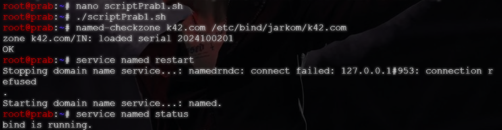
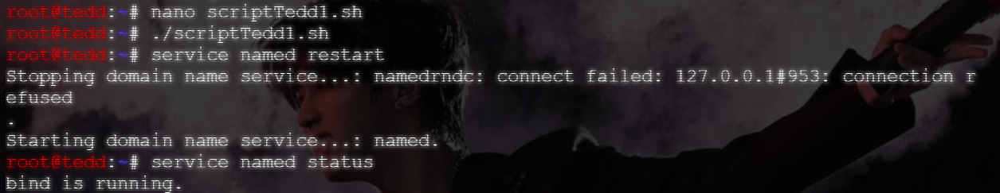

# Langkah-Langkah

## BIND9

Masukkan bind9 ke config di prab + tedd

```bash
up apt-get update
up apt-get install bind9 -y

# Cek dengan:
named -v
```

## Config di Prab

Untuk mengubah config dari `/etc/bind/named.conf.options` di `prab` dan `tedd`, edit isi dari file tersebut menggunakan `nano` dan sesuaikan dengan file `../soal4_prab.sh` || `../soal4_tedd.sh`.

Jika sudah, beri akses eksekusi dan jalankan. Cek BIND9 dengan menggunakan:

```bash
# Khusus untuk `prab` saja.
named-checkzone k42.com /etc/bind/jarkom/k42.com 

# Jalankan di keduanya
service named restart
service named status
```

## Bukti

- prab

- tedd

