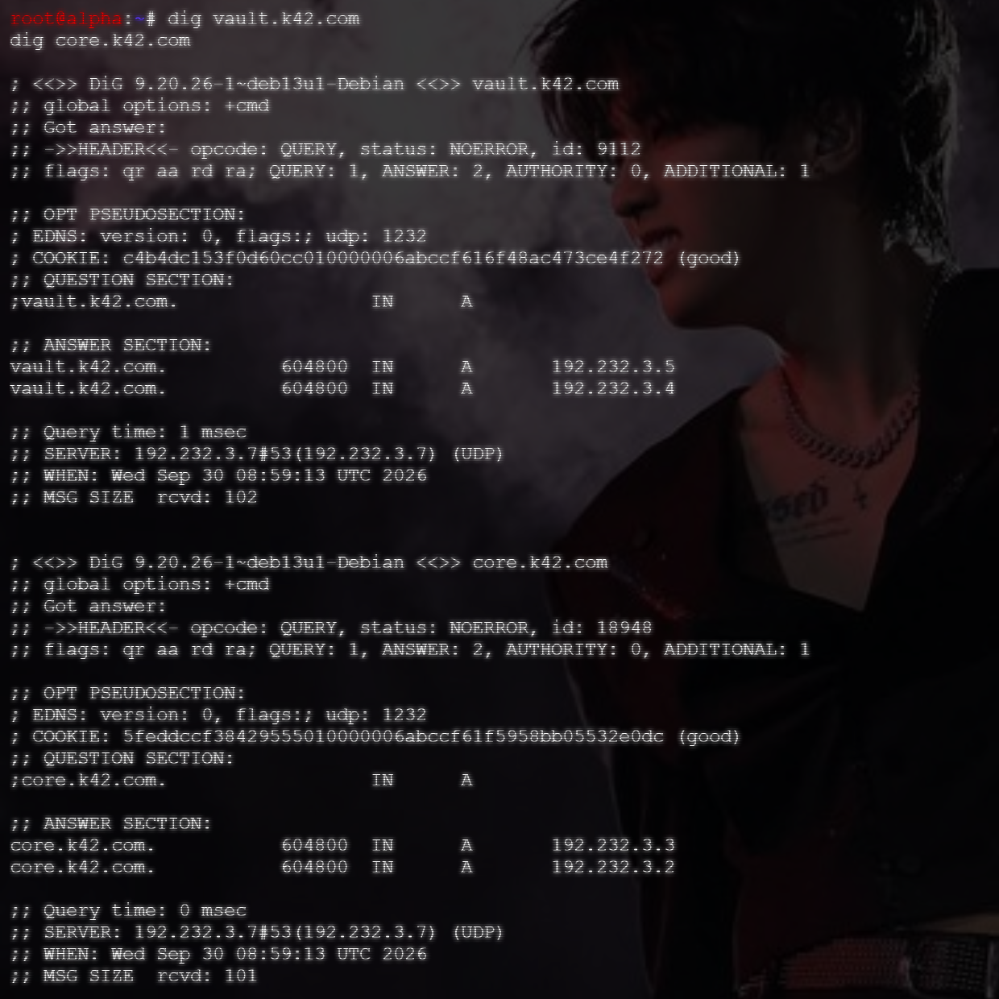
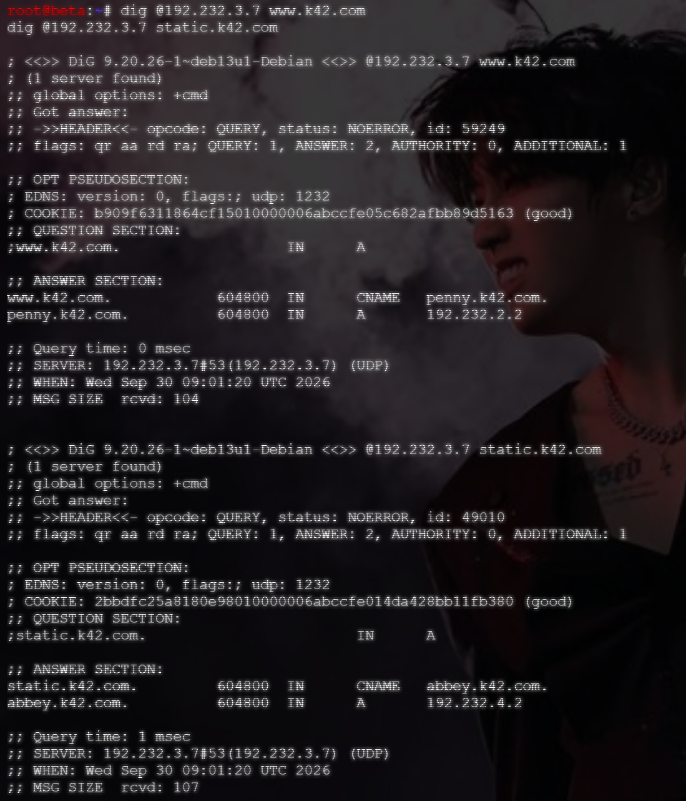

# Langkah-Langkah

## Ubah SOA untuk container `prab`

Buatlah file, dan ganti isi file `soal7.sh` dengan script dibawah ini:

```bash
#!/bin/bash

# --- Bagian 1: Konfigurasi Options ---
cat << 'EOF' > /etc/bind/named.conf.options
options {
    directory "/var/cache/bind";
    forwarders { 192.168.122.1; };
    allow-query { any; };
    dnssec-validation no;
    listen-on-v6 { any; };
};
EOF

# --- Bagian 2: Konfigurasi Local Zone ---
cat << 'EOF' > /etc/bind/named.conf.local
zone "k42.com" {
    type master;
    notify yes;
    also-notify { 192.232.3.6; };
    allow-transfer { 192.232.3.6; };
    file "/etc/bind/jarkom/k42.com";
};
EOF

# --- Bagian 3: Pembuatan File Zona k42.com (Langkah 5, 6, dan 7) ---
mkdir -p /etc/bind/jarkom

cat << 'EOF' > /etc/bind/jarkom/k42.com
;
; BIND data file for k42.com
;
$TTL    604800
@       IN  SOA     prab.k42.com. root.k42.com. (
                        2024100203      ; Serial (Dinaikkan agar sync ke tedd)
                        604800          ; Refresh
                        86400           ; Retry
                        2419200         ; Expire
                        604800 )        ; Negative Cache TTL
;
@       IN  NS      prab.k42.com.
@       IN  NS      tedd.k42.com.

; --- A Record Seluruh Entitas ---
rootkit IN  A       192.232.1.1
delta   IN  A       192.232.1.2
epsilon IN  A       192.232.1.3
penny   IN  A       192.232.2.2
molly   IN  A       192.232.3.2
oblada  IN  A       192.232.3.3
desmond IN  A       192.232.3.4
obladi  IN  A       192.232.3.5
tedd    IN  A       192.232.3.6
prab    IN  A       192.232.3.7
abbey   IN  A       192.232.4.2
gamma   IN  A       192.232.5.2
beta    IN  A       192.232.5.3
alpha   IN  A       192.232.5.4

; --- A Record Load Balancing (Tahap 7) ---
vault   IN  A       192.232.3.5   ; IP Obladi
vault   IN  A       192.232.3.4   ; IP Desmond
core    IN  A       192.232.3.3   ; IP Oblada
core    IN  A       192.232.3.2   ; IP Molly

; --- CNAME Record (Tahap 7) ---
www     IN  CNAME   penny
static  IN  CNAME   abbey
EOF

# --- Bagian 4: Restart Layanan BIND9 ---
service named restart
service named status
echo "Konfigurasi DNS Master (Prab) Berhasil Dijalankan!"
```

Jika sudah, jalankan file yang sudah diubah tersebut dan restart layanan BIND9.

```bash
service named restart
service named status
```

## Verifikasi ke `tedd`

Jika sudah, jalankan `dig`.

``` bash
dig @192.232.3.6 k42.com soa
# Dianggap berhasil apabila nomor serialnya sudah sama.
```

## Uji Coba dari Dua Klien Berbeda

- Dari alpha

``` bash
dig @192.232.3.7 vault.k42.com
dig @192.232.3.7 core.k42.com
```

- Dari beta

``` bash
dig @192.232.3.7 vault.k42.com
dig @192.232.3.7 core.k42.com
```

## Penjelasan

## Bukti

- alpha

- beta

