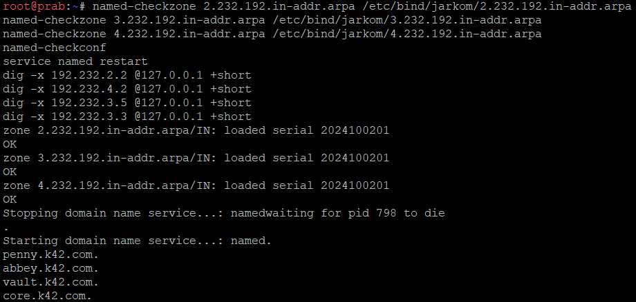
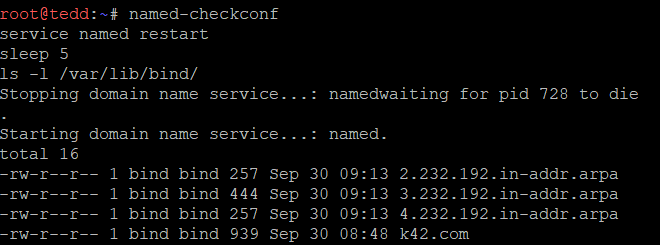

# Soal 8

"Di prab (master) deklarasikan reverse zone untuk segmen jaringan  tempat abbey, penny, area vault, dan area core berada. Di tedd (slave) tarik reverse zone tersebut sebagai slave, isi PTR untuk keempat hostname itu agar pencarian balik IP address mengembalikan hostname yang benar, lalu pastikan query reverse untuk alamat abbey, penny, area vault, dan area core dijawab authoritative."

## Setup Prab

Untuk memulai, kita pertama perlu untuk konfigurasi Prab terlebih dahulu. Pertama, kita perlu untuk mendeklarasikan reverse zonenya terlebih dahulu. Kita jalankan kode berikut.

```text
cat > /etc/bind/named.conf.local <<'EOF'
zone "k42.com" {
    type master;
    notify yes;
    also-notify { 192.232.3.6; };
    allow-transfer { 192.232.3.6; };
    file "/etc/bind/jarkom/k42.com";
};

zone "2.232.192.in-addr.arpa" {
    type master;
    notify yes;
    also-notify { 192.232.3.6; };
    allow-transfer { 192.232.3.6; };
    file "/etc/bind/jarkom/2.232.192.in-addr.arpa";
};

zone "3.232.192.in-addr.arpa" {
    type master;
    notify yes;
    also-notify { 192.232.3.6; };
    allow-transfer { 192.232.3.6; };
    file "/etc/bind/jarkom/3.232.192.in-addr.arpa";
};

zone "4.232.192.in-addr.arpa" {
    type master;
    notify yes;
    also-notify { 192.232.3.6; };
    allow-transfer { 192.232.3.6; };
    file "/etc/bind/jarkom/4.232.192.in-addr.arpa";
};
EOF
```

Lalu, kita perlu untuk membuat file zona dan kita isikan PTR.

```text
cat > /etc/bind/jarkom/2.232.192.in-addr.arpa <<'EOF'
$TTL    604800
@       IN      SOA     prab.k42.com. root.k42.com. (
                        2024100201      ; Serial
                        604800          ; Refresh
                        86400           ; Retry
                        2419200         ; Expire
                        604800 )        ; Negative Cache TTL
;
@       IN      NS      prab.k42.com.
@       IN      NS      tedd.k42.com.
2       IN      PTR     penny.k42.com.
EOF
```

```text
cat > /etc/bind/jarkom/3.232.192.in-addr.arpa <<'EOF'
$TTL    604800
@       IN      SOA     prab.k42.com. root.k42.com. (
                        2024100201      ; Serial
                        604800          ; Refresh
                        86400           ; Retry
                        2419200         ; Expire
                        604800 )        ; Negative Cache TTL
;
@       IN      NS      prab.k42.com.
@       IN      NS      tedd.k42.com.
5       IN      PTR     vault.k42.com.
4       IN      PTR     vault.k42.com.
3       IN      PTR     core.k42.com.
2       IN      PTR     core.k42.com.
EOF
```

```text
cat > /etc/bind/jarkom/3.232.192.in-addr.arpa <<'EOF'
$TTL    604800
@       IN      SOA     prab.k42.com. root.k42.com. (
                        2024100201      ; Serial
                        604800          ; Refresh
                        86400           ; Retry
                        2419200         ; Expire
                        604800 )        ; Negative Cache TTL
;
@       IN      NS      prab.k42.com.
@       IN      NS      tedd.k42.com.
5       IN      PTR     vault.k42.com.
4       IN      PTR     vault.k42.com.
3       IN      PTR     core.k42.com.
2       IN      PTR     core.k42.com.
EOF
```

```text
cat > /etc/bind/jarkom/4.232.192.in-addr.arpa <<'EOF'
$TTL    604800
@       IN      SOA     prab.k42.com. root.k42.com. (
                        2024100201      ; Serial
                        604800          ; Refresh
                        86400           ; Retry
                        2419200         ; Expire
                        604800 )        ; Negative Cache TTL
;
@       IN      NS      prab.k42.com.
@       IN      NS      tedd.k42.com.
2       IN      PTR     abbey.k42.com.
EOF
```

Setelah itu kita, mengecek dan restart.

```text
named-checkzone 2.232.192.in-addr.arpa /etc/bind/jarkom/2.232.192.in-addr.arpa
named-checkzone 3.232.192.in-addr.arpa /etc/bind/jarkom/3.232.192.in-addr.arpa
named-checkzone 4.232.192.in-addr.arpa /etc/bind/jarkom/4.232.192.in-addr.arpa
named-checkconf
service named restart
dig -x 192.232.2.2 @127.0.0.1 +short
dig -x 192.232.4.2 @127.0.0.1 +short
dig -x 192.232.3.5 @127.0.0.1 +short
dig -x 192.232.3.3 @127.0.0.1 +short
```



Disini sudah terlihat bahwa setiap zona menjawab dengan OK dengan serial ..201, named-checkconf tidak mengeluarkan error, dan keempat query reversenya terjawab dengan benar.

## Setup Tedd

Setelah selesai setup prab, kita setup dulu zona slavenya di dalam tedd. Kita jalankan berikut untuk menambahkannya.

```text
cat >> /etc/bind/named.conf.local <<'EOF'

zone "2.232.192.in-addr.arpa" {
    type slave;
    masters { 192.232.3.7; };
    file "/var/lib/bind/2.232.192.in-addr.arpa";
};

zone "3.232.192.in-addr.arpa" {
    type slave;
    masters { 192.232.3.7; };
    file "/var/lib/bind/3.232.192.in-addr.arpa";
};

zone "4.232.192.in-addr.arpa" {
    type slave;
    masters { 192.232.3.7; };
    file "/var/lib/bind/4.232.192.in-addr.arpa";
};
EOF
```

Setelah menjalankannya, kita mengecek dengan berikut.

```text
named-checkconf
service named restart
sleep 5
ls -l /var/lib/bind/
```



Dan terakhir kita verifikasi authorative di tedd.

```text
dig -x 192.232.2.2 @127.0.0.1
dig -x 192.232.4.2 @127.0.0.1
dig -x 192.232.3.5 @127.0.0.1
dig -x 192.232.3.3 @127.0.0.1
```

Hasilnya akan terlihat seperti berikut.

```text
root@tedd:~# dig -x 192.232.2.2 @127.0.0.1
dig -x 192.232.4.2 @127.0.0.1
dig -x 192.232.3.5 @127.0.0.1
dig -x 192.232.3.3 @127.0.0.1

; <<>> DiG 9.20.29-1~deb13u1-Debian <<>> -x 192.232.2.2 @127.0.0.1
; (1 server found)
;; global options: +cmd
;; Got answer:
;; ->>HEADER<<- opcode: QUERY, status: NOERROR, id: 63623
;; flags: qr aa rd ra; QUERY: 1, ANSWER: 1, AUTHORITY: 0, ADDITIONAL: 1

;; OPT PSEUDOSECTION:
; EDNS: version: 0, flags:; udp: 1232
; COOKIE: e55805a36db29e25010000006abcd2d454d12e3d5daf747a (good)
;; QUESTION SECTION:
;2.2.232.192.in-addr.arpa.      IN      PTR

;; ANSWER SECTION:
2.2.232.192.in-addr.arpa. 604800 IN     PTR     penny.k42.com.

;; Query time: 0 msec
;; SERVER: 127.0.0.1#53(127.0.0.1) (UDP)
;; WHEN: Wed Sep 30 09:13:56 UTC 2026
;; MSG SIZE  rcvd: 108


; <<>> DiG 9.20.29-1~deb13u1-Debian <<>> -x 192.232.4.2 @127.0.0.1
; (1 server found)
;; global options: +cmd
;; Got answer:
;; ->>HEADER<<- opcode: QUERY, status: NOERROR, id: 58497
;; flags: qr aa rd ra; QUERY: 1, ANSWER: 1, AUTHORITY: 0, ADDITIONAL: 1

;; OPT PSEUDOSECTION:
; EDNS: version: 0, flags:; udp: 1232
; COOKIE: e946b35d4f01765b010000006abcd2d4bb9fe4f83eae662b (good)
;; QUESTION SECTION:
;2.4.232.192.in-addr.arpa.      IN      PTR

;; ANSWER SECTION:
2.4.232.192.in-addr.arpa. 604800 IN     PTR     abbey.k42.com.

;; Query time: 0 msec
;; SERVER: 127.0.0.1#53(127.0.0.1) (UDP)
;; WHEN: Wed Sep 30 09:13:56 UTC 2026
;; MSG SIZE  rcvd: 108


; <<>> DiG 9.20.29-1~deb13u1-Debian <<>> -x 192.232.3.5 @127.0.0.1
; (1 server found)
;; global options: +cmd
;; Got answer:
;; ->>HEADER<<- opcode: QUERY, status: NOERROR, id: 55534
;; flags: qr aa rd ra; QUERY: 1, ANSWER: 1, AUTHORITY: 0, ADDITIONAL: 1

;; OPT PSEUDOSECTION:
; EDNS: version: 0, flags:; udp: 1232
; COOKIE: 0bf6183ec6bceb19010000006abcd2d4199487c1c99452fd (good)
;; QUESTION SECTION:
;5.3.232.192.in-addr.arpa.      IN      PTR

;; ANSWER SECTION:
5.3.232.192.in-addr.arpa. 604800 IN     PTR     vault.k42.com.

;; Query time: 0 msec
;; SERVER: 127.0.0.1#53(127.0.0.1) (UDP)
;; WHEN: Wed Sep 30 09:13:56 UTC 2026
;; MSG SIZE  rcvd: 108


; <<>> DiG 9.20.29-1~deb13u1-Debian <<>> -x 192.232.3.3 @127.0.0.1
; (1 server found)
;; global options: +cmd
;; Got answer:
;; ->>HEADER<<- opcode: QUERY, status: NOERROR, id: 58612
;; flags: qr aa rd ra; QUERY: 1, ANSWER: 1, AUTHORITY: 0, ADDITIONAL: 1

;; OPT PSEUDOSECTION:
; EDNS: version: 0, flags:; udp: 1232
; COOKIE: 8eaf0c3af18855db010000006abcd2d4fc6d2712071c7b4b (good)
;; QUESTION SECTION:
;3.3.232.192.in-addr.arpa.      IN      PTR

;; ANSWER SECTION:
3.3.232.192.in-addr.arpa. 604800 IN     PTR     core.k42.com.

;; Query time: 0 msec
;; SERVER: 127.0.0.1#53(127.0.0.1) (UDP)
;; WHEN: Wed Sep 30 09:13:56 UTC 2026
;; MSG SIZE  rcvd: 107
```

Terlihat semua statusnya NOERROR dan juga ada flag aa dan mengeluarkan alamat webnya masing-masing.
