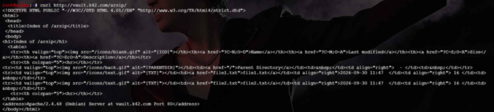

# Langkah-Langkah

## Jalankan script `obladi` dan `desmond`

Buat file script `soal9_obladi.sh` `soal9_desmond.sh` dan berikan izin eksekusi, kemudian jalankan. Pastikan Apache2 berhaasil running


## Uji akses via Hostname

Jalankan pengujian menggunakan `curl <domain>`, namun apabila node alpha belum terhubung dengan node `obladi`, maka bisa menggunakan `curl --resolve <domain>:80:<IP WEB SERVER> <domain>`

```bash
curl http://vault.k42.com/arsip/
```


