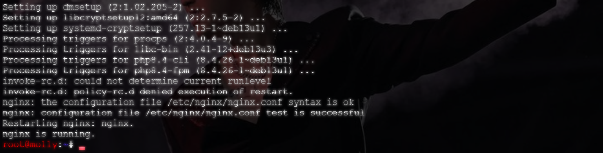
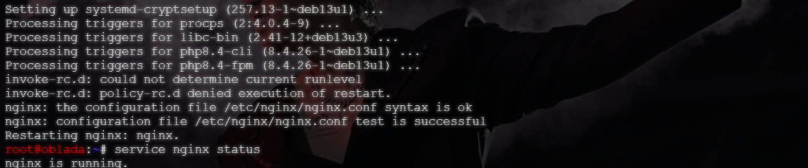
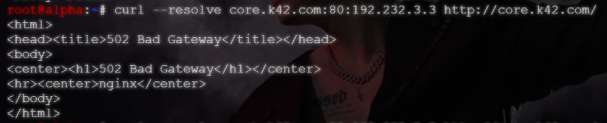
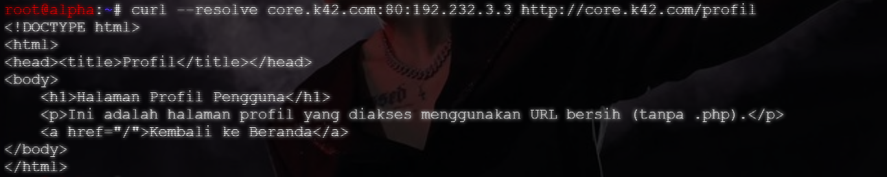

# Langkah-Langkah

## Jalankan cript `oblada` dan `molly`

Buat file script `soal10_oblada.sh` `soal10_molly.sh` dan berikan izin eksekusi, kemudian jalankan. Pastikan Nginx berhaasil running.




## Uji curl `beranda` dan `profil`

Di dalam script untuk `oblada` dan `molly` terdapat pembuatan file `index.php` dan `profil.php`.

Jalankan uji coba dengan perintah:

```bash
curl --resolve <domain>:80:<IP WEB SERVER> <domain>
```



