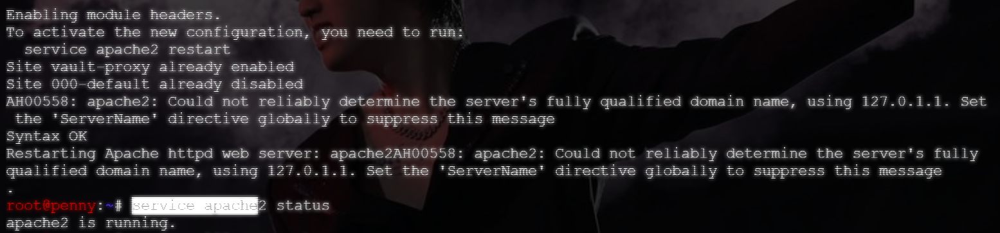
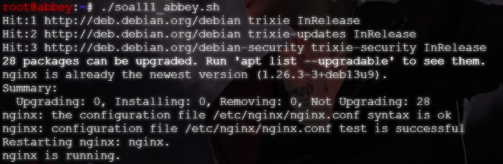
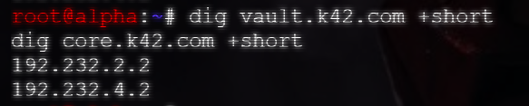
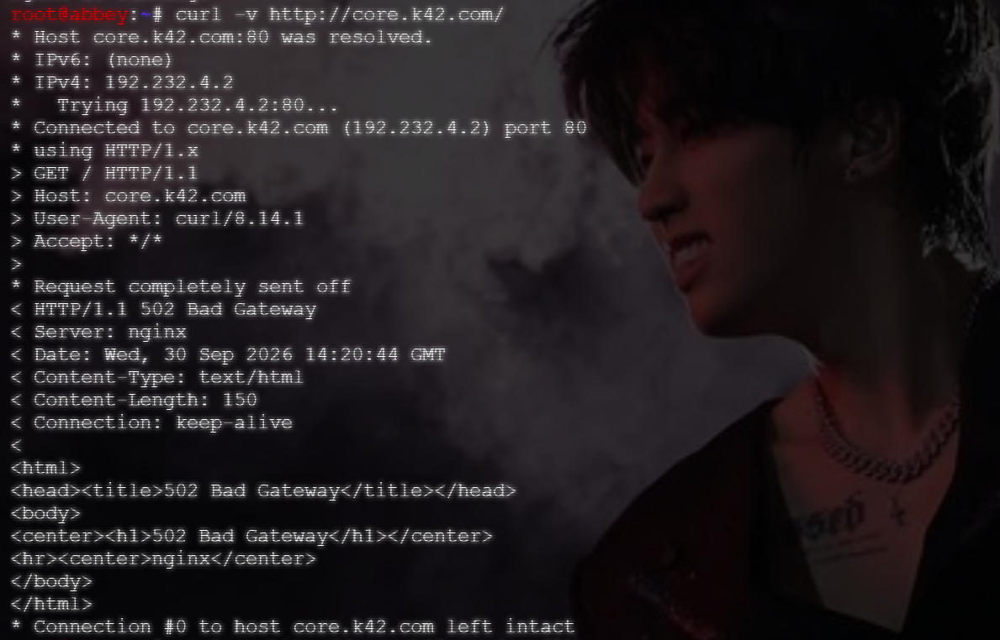
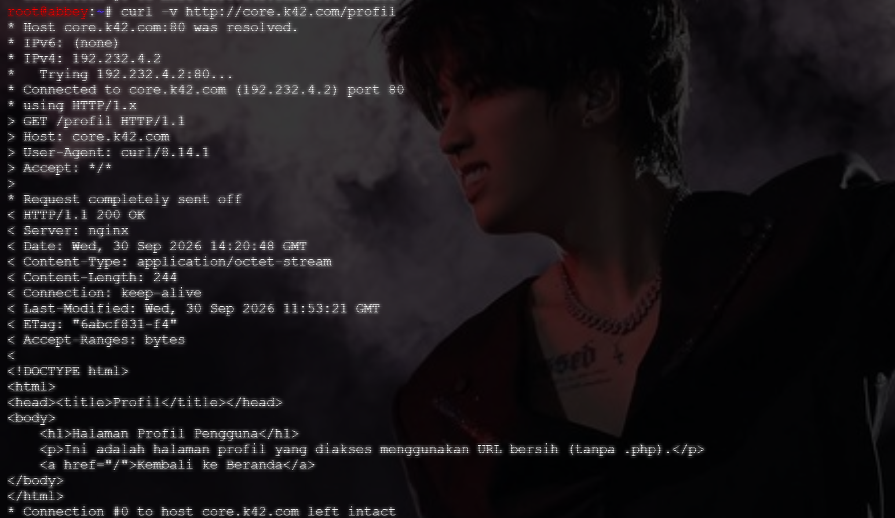

# Langkah-Langkah

## Jalankan script `abbey` dan `penny`

Buat file `soal11_abbey.sh` dan `soal11_penny.sh` di masing-masing container, berikan izin eksekusi dan jalankan.




Pada container `prab`, buatlah `soal11_prab.sh` dan sesuaikan isinya dengan script yang telah dibuat. Berikan izin eksekusi dan jalankan. Jangan lupa lakukan **reload** agar tidak tertumpuk BIND9-nya.


## Konfigurasi nameserver

Pada node `penny` dan `abbey`, tambahkan nameserver 192.232.3.7 dan nameserver 8.8.8.8 agar bisa melakukan uji coba di tahap selanjutnya.

**Catatan**
Untuk `nameserver 8.8.8.8` harus diletakkan di paling belakang.

```bash
# Milik penny
up echo -e 'nameserver 192.232.3.7\nnameserver 192.232.3.5\nnameserver 192.232.3.4\nnameserver 192.168.122.1\nnameserver 8.8.8.8' > /etc/resolv.conf

# Milik abbey
up echo -e 'nameserver 192.232.3.7\nnameserver 192.232.3.3\nnameserver 192.232.3.2\nnameserver 192.168.122.1\nnameserver 8.8.8.8' > /etc/resolv.conf
```

## Uji Coba

- Uji coba di `alpha`

    Buka container `alpha` dan lakukan `dig vault.k42.com +short` dan `dig core.k42.com +short`. Pastikan output yang diberikan adalah IP dari `abbey` dan `penny`.

    

- Uji coba di `penny`

    Buka container `penny` dan pastikan apache2 sedang running. Kemudian jalankan `curl -v http://vault.k42.com/arsip/`. Jika sudah benar, maka outputnya adalahh isi dari file yang telah dibuat.

      

- Uji coba di `abbey`

    Buka container `abbey` dan pastikan Nginx sedang berjalan. Kemudian jalankan `curl -v http://core.k42.com/` dan `curl -v http://core.k42.com/profil`.

    
    
