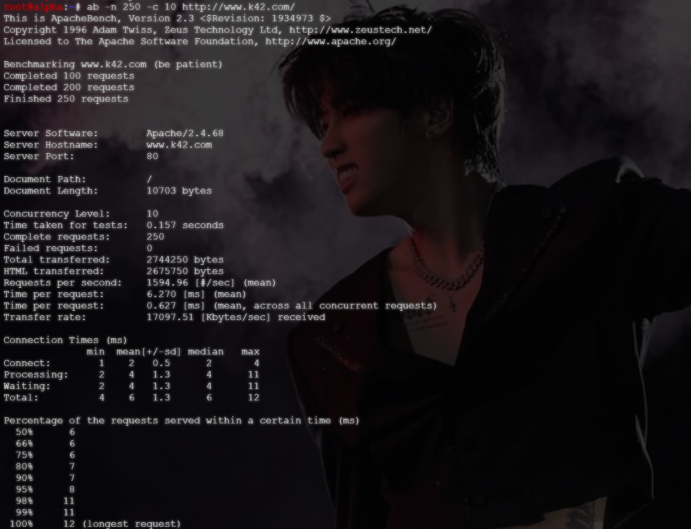
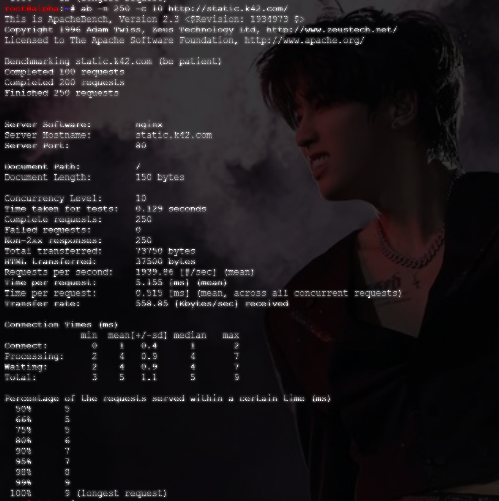

# Langkah-Langkah

## Mengenai soal 16

Soal 16 berfokus pada pengujian atau *stress test server* menggunakan perintah ab (ApacheBench) pada `www.k42.coom` dan `static.k42.com`.

## Persiapan

Sebelum melakukan uji coba, pastikan Nginx running di `abbey` dan Apache2 running di `penny`.


Selain itu, pastikan pula container `alpha` sudah terinstal ApacheBench (ab).


## Uji Coba

Masuk ke container `alpha` dan jalankan perintah untuk melakukan *stress test*.

```bash
# untuk static.k42.com
ab -n 250 -c 10 http://static.k42.com/

# untuk www.k42.com
ab -n 250 -c 10 http://www.k42.com/
```

- ApacheBench `www.k42.com`


- ApacheBench `static.k42.com`


## Rangkuman

Dari hasil data yang telah didapatkan dengan menggunakan perintah ApacheBench (ab), dapat disimpulkan bahwa:

1. *Stress Test* pada `penny`
    > Dari hasil test diketahui bahwa total 250 request tidak ada yang gagal atau *no failed request* dengan waktu per *request*-nya 6.270 ms.

    >Data disini juga menampilkan bahwa *request per second*-nya adalah 1594.96 dan memiliki min = 4ms, mean = 6ms, dan max = 12ms.
2. *Stress Test* pada `abbey`
    > Dari hasil test diketahui bahwa dengan total 250 paket, tidak ada yang gagak atau *no failed request* dengan waktu per *request*-nya lebih cepat dibandingkan dari `penny`, yakni sebesar 5.155ms.

    > Data juga menampulkan bahwa *request per second*-nya sebesar 1939.86 dengan min = 3ms, mean = 5ms, dan max = 9ms.
