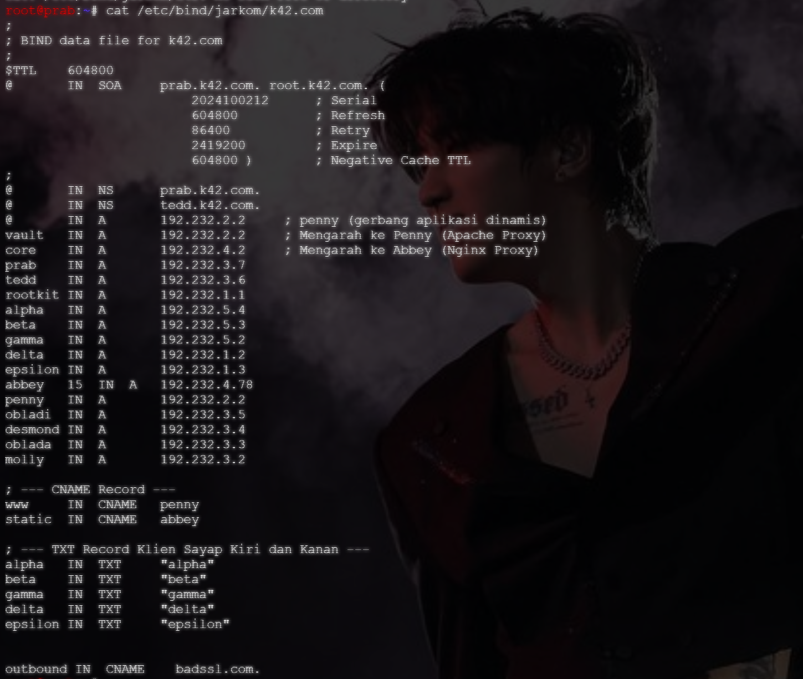
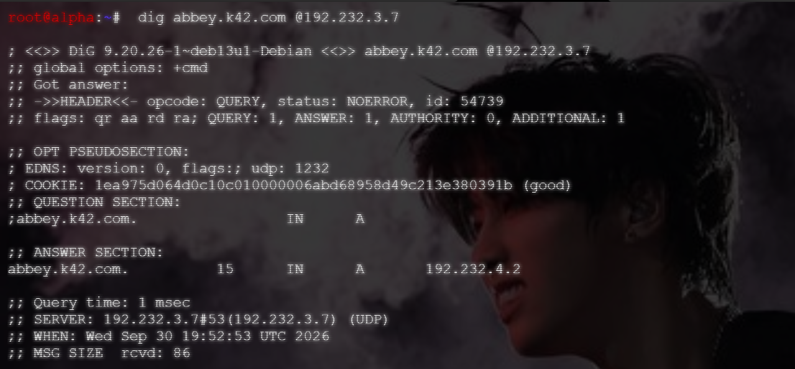
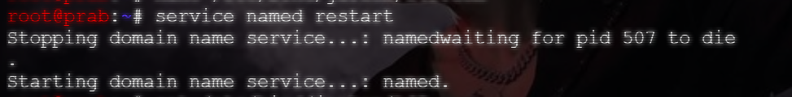
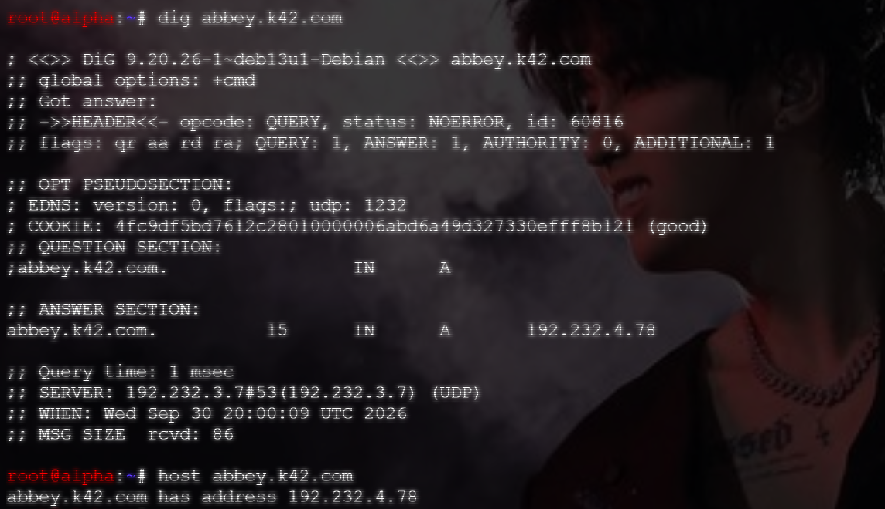

# Langkah-Langkah

## Setup container `prab`

Sebelum menyelesaikan soal 18, ubah A rcord dari `abbey.k42.com` menjadi IP fiktif dan memastikan TTL-nya 15 detik. Selain itu perlu juga menaikkan serial SOA pada file.

Cari baris `abbey` dan ubah IP serta tambahkan TTL menadi 15 detik.

```text
abbey   15  IN  A   192.232.4.78
```

Setelahnya, pastikan nomor serial SOA sudah **berganti**.



## Uji Coba

Untuk melakukan uji coba, perlu merestart dan melakukan dig secara bersamaan di dua terminal yang berbeda.

Sebelum BIND9 di-restart, pastikan IP Address dari `abbey` masih `192.232.4.2` dan belum berganti ke IP fiktif.



Selanjutnya, restart BIND9 di container `alpha` dan langsung jalankan dig pada `alpha` untuk melihat perubahan pada IP Address `abbey`.



