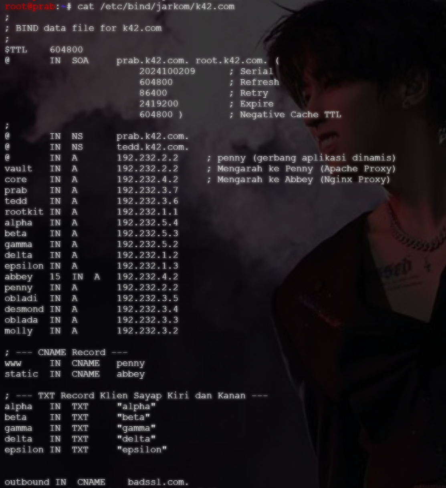
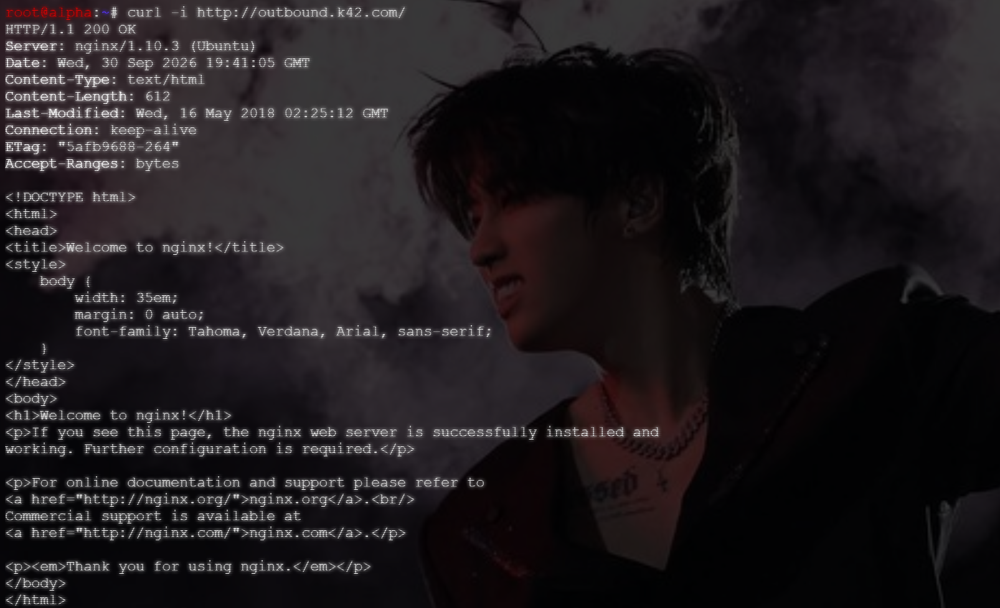

# Langkah-Langkah

## Setup pada `prab`

Masuk ke file /etc/bind/jarkom/k42.com. Kemudian naikkan serial SOA di bagian atas file zone sebanyak 1 angka saja. Selanjutnya input baris CNAME di bagian bawah file:

```text
outbound      IN      CNAME   badssl.com.
```



Apabila telah selesai, maka lakukan restart dan cek statusnya apakah sudah berjalan atau belum.

```bash
named-checkzone k42.com /etc/bind/jarkom/k42.co
service named restart
service named status
```

**CATATAN**
Jangan lupa cek pula pada container `tedd`. Pastikan zona melakukan *zone transfer* dengan sukses agar SOA dapat tersinkronisasi.

## Uji Coba

Masuk ke container `alpha` dan lakukan uji coba ke `outbound.k42.com` dengan menggunakan curl.

```bash
curl -i http://outbound.k42.com/
```

Dengan melakukan uji coba ini, output yang diharapkan adalah:

1. Status HTTP = 200 OK (biasanya)
2. `curl` yang menampilkan isi halaman web `badssl.com`.


