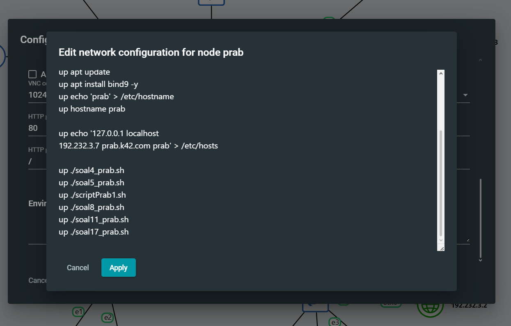
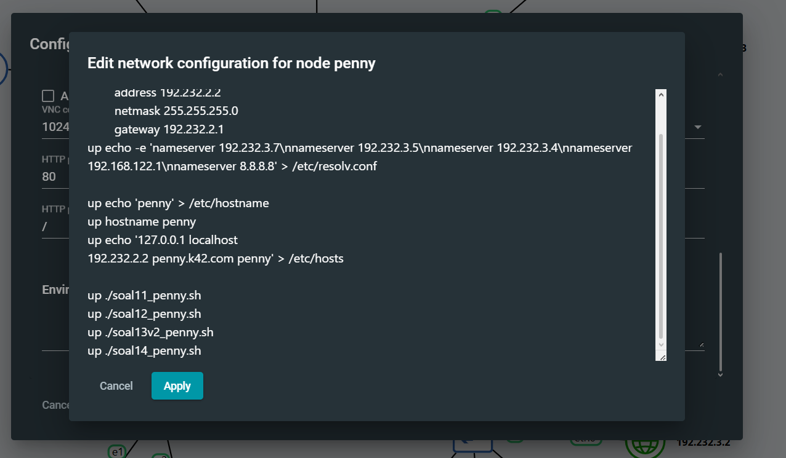

# Soal 20
"Setelah semua penyelesaian selesai, pastikan semua service dan konfigurasi yang telah dikerjakan dari awal tetap berjalan normal dan berstatus autostart saat node di-restart (khusus untuk kasus ini, abaikan konfigurasi nomor 18 dan biarkan koordinat kembali normal)."

Untuk soal nomor 20 ini kita cukup untuk abaikan konfigurasi nomor 18 terlebih dahulu dan membiarkan koordinatnya kembali ke normal.

Setelah itu, kita masukkan dan jalankan setiap file .sh (script) yamg dibuat untuk mengerjakan soal-soal sebelumnya lewat:
```
nano /root/soal(nomor soal)_(nama node).sh
chmod +x /root/soal(nomor soal)_(nama node).sh
```

Setelah menjalankan itu, kita masuk ke setiap node yang memiliki script tersebut (kecuali beberapa) dan menambahkannya ke dalam config nodenya lewat
```
up ./(scriptnya).sh
```

Setelah selesai, akan terlihat sebagai berikut.



Dan seterusnya.