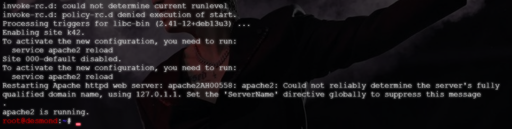
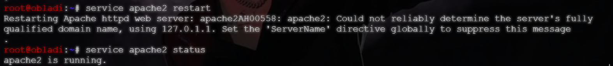
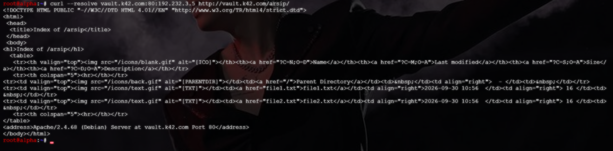

# Langkah-Langkah

## Jalankan script `obladi` dan `desmond`

Buat file script `soal9_obladi.sh` dan berikan izin eksekusi, kemudian jalankan. Pastikan Apache2 berhaasil running



## Uji akses via Hostname

Jalankan pengujian menggunakan `curl --resolve <domain>:80:<IP WEB SERVER> <domain>`

```bash
curl --resolve vault.k42.com:80:192.232.3.5 http://vault.k42.com/arsip/
# Gunakan IP Address dari OBLADI
```

